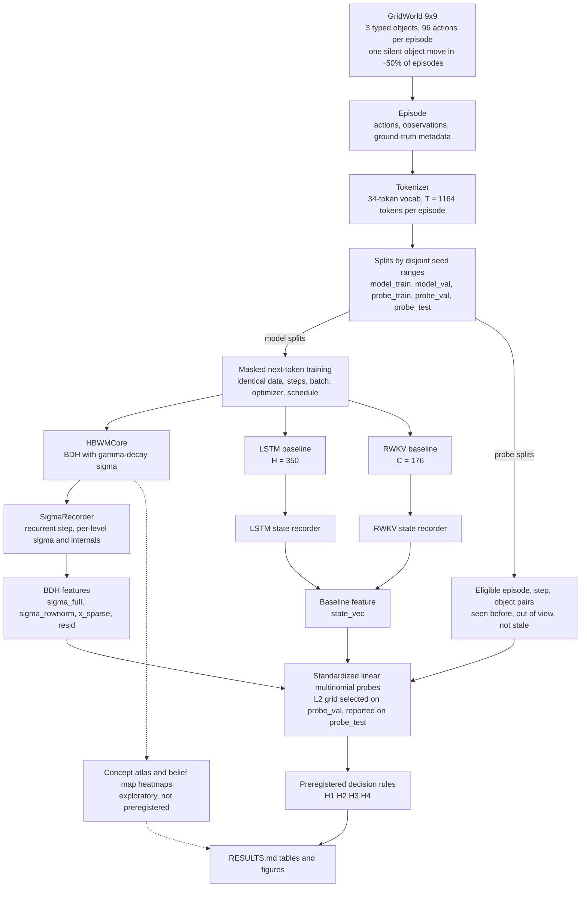
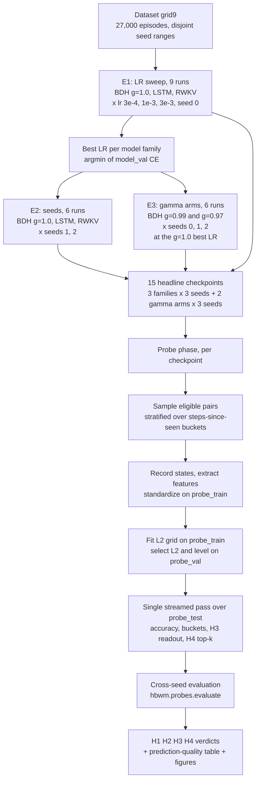

# Hebbian Belief-State World Model (HBWM): Study 1

A world model whose belief state is the plastic synapse state $\sigma$ of a BDH (the Dragon Hatchling) core.
Study 1 asks a single question: **does $\sigma$ encode linearly readable beliefs about a partially observed gridworld?**
Three parameter-matched sequence models (BDH, LSTM, RWKV) are trained to predict observations in a 9x9 gridworld, their internal states are read out with standardized linear probes, and four preregistered hypotheses (H1 to H4) are decided by rules fixed before any headline run.

**New here? Read [docs/EXPLAINER.md](docs/EXPLAINER.md)**: the architecture, the method, why each experimental choice was made, and what was found, in one document.

Proposal: [SPEC.md](SPEC.md) &middot; Buildable design: [docs/superpowers/specs/2026-08-22-hbwm-study1-design.md](docs/superpowers/specs/2026-08-22-hbwm-study1-design.md) &middot; Results log: [RESULTS.md](RESULTS.md)

---

## Status (2026-08-25)

| Phase | State |
|---|---|
| Implementation | Complete. 111 tests pass (CPU, tiny configs). |
| Dataset `grid9` | Generated: 27,000 episodes, 1,164 tokens each. |
| E0 sanity, calibration | Done ([RESULTS.md](RESULTS.md)). |
| E1 LR sweep (9 runs) | Complete. Best LR = 3e-3 for all three model families. |
| E2 seeds (6 runs) | Complete. |
| E3 gamma arms (6 runs) | 4 of 6 done. `gamma = 0.97` seeds 1 and 2 in flight. |
| Probe phase | Pending. |
| H1 to H4 verdicts | Pending. |

**Provisional best validation CE (nats/observation token), all at lr 3e-3.**
Uniform-prior chance is $\ln 34 \approx 3.53$ nats.

| Model / arm | seed 0 | seed 1 | seed 2 |
|---|---|---|---|
| BDH, gamma = 1.00 | 0.0240 | 0.0252 | 0.0232 |
| BDH, gamma = 0.99 | 0.0242 | 0.0244 | 0.0246 |
| BDH, gamma = 0.97 | 0.0268 | pending | pending |
| LSTM | 0.0286 | 0.0275 | 0.0290 |
| RWKV | 0.0235 | 0.0243 | 0.0237 |

This table is **training-quality only**; the preregistered hypotheses are decided by the probe phase, not by CE.
Its purpose is the "interpretability was not bought with broken prediction" check.

---

## System overview



Only the BDH core and its instrumentation are novel. Everything else is deliberately conventional.

---

## Background and architecture

### Upstream BDH

The core is [pathwaycom/bdh](https://github.com/pathwaycom/bdh), vendored **untouched** under `hbwm/bdh/upstream/` (MIT, pinned commit `2b0d7a45b058d4309c84a10e0768d541fe18bdc2`, sha256 of `bdh.py` recorded in [`hbwm/bdh/upstream/UPSTREAM.md`](hbwm/bdh/upstream/UPSTREAM.md)).
Upstream attention has no softmax and no explicit state: it is the parallel form `scores = (QR @ KR.mT).tril(-1); y = scores @ V` with sparse positive `Q = K = relu(x @ encoder)` and dense `V = x`, and one shared `encoder / encoder_v / decoder` reused across `n_layer` levels.

Two consequences shape this study:

1. The recurrent equivalent of upstream's state is one `N x D` matrix per head per level (call it $\sigma$), so there are `n_layer` distinct $\sigma$'s per sequence, not an `n x n` synapse matrix. The `N x N` "synapse matrix" is a **view**, $\tilde{\sigma} = \sigma \cdot$ `encoder_v`, of rank at most `D`; it is never materialized.
2. Upstream has **no forgetting**: the state is a pure sum. RoPE rotates, it does not decay. H2 needs a controlled knob, so HBWM adds one.

### `HBWMCore` (`hbwm/bdh/core.py`)

`HBWMCore` subclasses upstream `BDH`. It overrides `forward` (decay mask, loss mask, optional internals) and adds a recurrent `step()`. Upstream files are never edited, so the diff against upstream stays trivial.

**Parallel path (training).** Upstream's `tril(diagonal=-1)` is replaced by a decay mask buffer:

$$M[t, s] = \gamma^{\,t-1-s} \quad \text{for } s < t, \qquad M[t, s] = 0 \quad \text{otherwise.}$$

At $\gamma = 1$ this is exactly upstream's causal mask, so the primary arm is upstream-faithful. `forward(idx, targets, loss_mask, return_internals)` restricts cross-entropy to observation tokens and can return per-level `x_sparse` and `resid`.

**Recurrent path (inference and instrumentation).** `step()` materializes $\sigma$ explicitly with shape `[L, B, nh, N, D]` and applies, per level and head, a **read before write** update:

$$y_t = q_t^{\top} \sigma_t, \qquad \sigma_{t+1} = \gamma\,\sigma_t + \alpha \, (k_t \otimes v_t), \qquad \sigma_t = \sum_{s<t} \gamma^{\,t-1-s}\, k_s \otimes v_s$$

with $k_t = q_t =$ `rope(relu(x_t @ encoder), t)` and $v_t = x_t$. Reading before writing reproduces `tril(diagonal=-1)` exactly. The write scale $\alpha$ is the `plasticity` stub for Study 2: `full` ($\alpha = 1$), `frozen` ($\alpha = 0$), `scaled` ($\alpha =$ `plasticity_scale`). Study 1 only ever uses `full`.

**Equivalence contract** (tested on CPU, fp32, tiny config, eval mode):

| Check | Tolerance |
|---|---|
| `forward` logits vs. sequential `step()` logits, gamma in {1.0, 0.9} | `atol = 1e-4` |
| $\sigma$ after `t` steps vs. the closed form above | `atol = 1e-5` |
| `frozen` leaves $\sigma$ untouched | bit-identical |
| `scaled` with scale s produces exactly s times the `full` delta | `atol = 1e-6` |
| gamma = 1, shared layers, eval mode vs. upstream `BDH.forward` | bit-identical |

**Synapse view.** `synapse(sigma_level, level, head, rows, cols)` computes `sigma_level[:, head][:, rows, :] @ encoder_v[head][:, cols]` lazily for index sets, so the full N x N is never materialized.

### Reference configuration

| Field | Value | Meaning |
|---|---|---|
| `n_layer` (L) | 6 | levels of the shared block |
| `n_embd` (D) | 64 | residual width |
| `n_head` (nh) | 4 | heads |
| `mlp_internal_dim_multiplier` | 128 | N = mult * D / nh = **2048** neurons per head |
| `vocab_size` | 34 | fixed tokenizer vocab |
| `dropout` | 0.1 | as upstream |
| `decay_gamma` | 1.0 primary; 0.99, 0.97 secondary | the forgetting knob |
| `share_layers` | `true` | one encoder / encoder_v / decoder across levels |
| `block_size` | 1164 | max T, sizes the decay-mask buffer |

Parameter count is `3 * nh * D * N + 2 * V * D` = **1,577,216**. One sequence's $\sigma$ is `6 * 4 * 2048 * 64` fp32 values, about 12.6 MB.

---

## Environment and tokenization

A 9x9 gridworld with 3 objects of **distinct** types (drawn from 4 possible types, so "object type k" is unambiguous). The agent moves N/E/S/W for 96 steps; moving into the boundary is a no-op. Every observation contains the agent's **absolute** `(x, y)` plus the 3x3 window centered on it (out-of-grid cells read `WALL`). Putting the agent's position in the observation is deliberate: it isolates "remember where objects are" from self-localization, giving the hypothesis its best shot.

**Silent move (the H3 manipulation).** With probability 0.5, at one step drawn uniformly from the middle half of the episode, one object that is **not currently in view** teleports to a uniformly random empty cell that is **also out of view**. At most one move per episode. The agent receives no signal until it re-observes the object. Steps between the move and its re-observation are flagged `stale` and excluded from probe eligibility, because the label is unknowable to the agent there.

**Vocabulary (34 tokens, independent of grid size).**

| ids | tokens |
|---|---|
| 0 | `BOS` |
| 1 | `PAD` (reserved, unused: all episodes have equal length) |
| 2 to 5 | `A_N, A_E, A_S, A_W` |
| 6 to 16 | `X_0` ... `X_10` |
| 17 to 27 | `Y_0` ... `Y_10` |
| 28 | `EMPTY` |
| 29 | `WALL` |
| 30 to 33 | `OBJ_0` ... `OBJ_3` |

**Sequence layout.**

```
sequence:  BOS, o_0, a_1, o_1, a_2, o_2, ..., a_L, o_L
o_t     :  [X_x, Y_y, c_0, c_1, ..., c_8]          11 tokens, window row-major
T       =  1 + 11 + 12*L  =  12L + 12  =  1164     at L = 96
```

The loss mask is `True` on all 97 * 11 = 1,067 observation tokens and `False` on `BOS` and the 96 action tokens: the model is scored only on predicting what it will see, never on predicting the policy.

**Policies.** Each episode draws one of `random_walk`, `sweep` (boustrophedon coverage of every cell, then random walk, which guarantees every object is seen at least once), or `waypoint` (repeated shortest paths to random targets), in roughly equal proportion.

**Splits by disjoint seed ranges**, so no episode is shared between model training and probing:

| split | episodes | used for |
|---|---|---|
| `model_train` | 20,000 | training all three models |
| `model_val` | 1,000 | LR selection and best-checkpoint selection |
| `probe_train` | 3,000 | fitting probes and the standardization statistics |
| `probe_val` | 1,000 | L2 selection, level selection |
| `probe_test` | 2,000 | all reported probe numbers |

---

## Baselines and fairness

Baseline widths are solved numerically so that total parameters land within +/-5% of the BDH reference (`uv run python -m hbwm.baselines.matching`):

| model | width | parameters | vs. BDH |
|---|---|---|---|
| BDH (reference) | D = 64, N = 2048, 6 levels | 1,577,216 | |
| LSTM | H = 350, 2 layers, embed 64 | 1,579,310 | +0.13% |
| RWKV-4-style | C = 176, 4 blocks | 1,631,168 | +3.42% |

The RWKV block is a minimal pure-PyTorch RWKV-4: time-mix with learnable per-channel `time_decay` and `time_first` plus token shift, channel-mix, pre-LN. Its WKV is computed in **chunks of 64** (within-chunk parallel, log-space `(num, den, max)` carried across chunks) so a forward pass is not a 1,164-step Python loop; the chunked implementation is tested against a naive sequential WKV to `atol = 1e-5`, including across chunk boundaries.

**Fairness protocol (preregistered).** Identical data, `max_steps` 4,000, batch 32 whole episodes, AdamW (betas 0.9 / 0.95, weight decay 0.1), 200 warmup steps then cosine decay to 0.1x, grad clip 1.0, fp32, masked CE, eval every 200 steps, best-val checkpoint kept. Per model family: sweep LR over {3e-4, 1e-3, 3e-3} at seed 0, pick the argmin of `model_val` CE, then run seeds 1 and 2 at that LR (seed 0 is reused).

**Probed state.** LSTM: `concat(h_1, c_1, h_2, c_2)`, 1,400 dims. RWKV: `[aa, bb, pp, x_prev_timemix, x_prev_channelmix]` concatenated over the 4 blocks, 3,520 dims. Both are read at exactly the same timestep as the BDH features (the last token of observation `o_t`).

---

## Experimental procedure



### Experiment matrix

| Experiment | Runs | Content |
|---|---|---|
| E0 sanity | 1 | upstream config scaled to D = 128 on tiny Shakespeare, 1,000 steps: loss decreases, samples non-degenerate |
| E1 LR sweep | 9 | {BDH gamma = 1, LSTM, RWKV} x {3e-4, 1e-3, 3e-3}, seed 0 |
| E2 seeds | 6 | {BDH gamma = 1, LSTM, RWKV} x seeds {1, 2} at best LR |
| E3 gamma arms | 6 | BDH gamma in {0.99, 0.97} x seeds {0, 1, 2} at the gamma = 1 best LR |
| **Total training runs** | **21** | plus E0 |

### Probe protocol

**Target.** For an (episode, step, object) triple, the object's true cell id in `{0 ... 80}`.

**Eligibility.** `steps_since_seen >= 1` (seen before, out of view now) **and** not `stale`. Up to 8 eligible steps are drawn per (episode, object), round-robin across the steps-since-seen buckets `{1-4, 5-8, 9-16, 17-32, 33-64, 65+}` so that long-horizon memory is not swamped by short-horizon pairs.

**Features.** All BDH features are per level, with heads concatenated; the feature timestep for every model, baselines included, is the last token of observation `o_t`, that is, the moment the model has just read the whole observation.

| name | dims (reference config) | meaning |
|---|---|---|
| `sigma_full` | nh * N * D = 524,288 | flattened per-level synapse state |
| `sigma_rownorm` | nh * N = 8,192 | L2 norm of each neuron's row of $\sigma$ ("synaptic load") |
| `x_sparse` | nh * N = 8,192 | activations-only ablation at step t |
| `resid` | D = 64 | residual stream at step t |
| `state_vec` (LSTM) | 1,400 | baseline |
| `state_vec` (RWKV) | 3,520 | baseline |

**Probe.** Linear multinomial logistic regression, no hidden layer, on per-feature standardized inputs. Adam lr 1e-3, 20 epochs, batch 512, L2 in {1e-4, 1e-3, 1e-2, 1e-1} selected on `probe_val`, reported on `probe_test`.

**Level selection.** `sigma_rownorm`, `x_sparse` and `resid` are probed at all 6 levels. `sigma_full` is probed at the two levels with the highest `sigma_rownorm` `probe_val` accuracy plus the last level (up to 3 levels), because probing all six is not affordable. Best level for any feature set is chosen on `probe_val`.

**Memory strategy.** Feature sets of at most 16k dims use every eligible `probe_train` example, cached in RAM as fp32. `sigma_full` trains on a **stratified 24,000-example subsample** cached as fp16 on disk one level at a time (about 25 GB of scratch, deleted after use, including on failure). Its evaluation is **streamed**: one pass of the recorder over `probe_val` scores the whole L2 grid at once, and one pass over `probe_test` scores the selected probe together with all its H4 top-k variants, so validation and test features are never cached.

**Reported per probe.** Top-1 accuracy, majority-class chance, feature count, 95% bootstrap CI resampled over test episodes, per-bucket accuracy, and the oracle-memory ceiling.

**H3 readout.** For `probe_test` episodes with `moved` and `reobserved_t >= 0`, the best `sigma_full` probe's `p(new cell)` and `p(old cell)` for the moved object are recorded from re-observation onward, with `steps_since_reobs` and `visible_now`.

**H4 retraining.** Features are ranked by the L2 norm of the probe's weight column across classes; the probe is retrained from scratch on the top-k features for each k, holding the full-feature L2 fixed (L2 is **not** re-selected per k) so that the accuracy curve isolates the effect of the feature budget alone. Localization is reported as the number of distinct neurons touched by the top-k features.

---

## Preregistration (Study 1)

*Preregistered at commit `e674b1d` (before any experiment run); reformatted since, substance unchanged. The canonical text is that commit's README.*

Environment: 9×9 gridworld, 3 distinct-type static objects, agent observes its (x, y) + a 3×3 window, 96 actions/episode, one silent object move in ~50 % of episodes. Models (≈1.58 M params each, same data/steps/optimizer): BDH (γ = 1.0 primary; γ ∈ {0.99, 0.97} secondary), LSTM, RWKV. LR chosen per model from {3e-4, 1e-3, 3e-3} on validation CE at seed 0; then 3 seeds.

Probe target: the true cell of an object that has been seen before and is currently out of view (and not silently moved without re-observation). Linear multinomial probes, L2 chosen on `probe_val`, reported on `probe_test`. Per BDH seed, each feature set reports its best level (chosen on `probe_val`).

Every probe feature is standardized before the linear layer: per-feature mean and standard deviation fitted on `probe_train` (std < 1e-6 → 1), applied identically to BDH features (σ_full, σ_rownorm, x_sparse, resid) and to the LSTM/RWKV state vectors, in training and in the streamed `probe_val`/`probe_test` passes. H4 ranks features by the L2 norm of the probe weights learned on these standardized features. The oracle-memory ceiling (predict the last-seen cell) is 1.0 by construction on this dataset (eligibility excludes stale pairs and static objects never move) and is reported for completeness, not as an informative baseline.

**Decision rules (3 seeds, fixed before any headline run):**

- **H1**: supported iff mean acc(σ_full) exceeds each of {x_sparse, LSTM state, RWKV state} by > 5 points **and** all three paired-by-seed differences are positive. Kill criterion: H1 fails against the LSTM state.
- **H2**: accuracy of the best σ_full probe by steps-since-seen bucket {1-4, 5-8, 9-16, 17-32, 33-64, 65+}. Graceful iff acc(33-64) ≥ 0.5·acc(1-4) and no bucket < 50 % of its predecessor. Reported for each γ arm and both baselines.
- **H3**: on moved + re-observed test episodes: probe p(new cell) vs p(old cell) from re-observation onward; latency = first step with p(new) > p(old). Supported iff latency ≤ 5 steps in ≥ 70 % of such episodes (episodes that never flip count as failures; mean over seeds).
- **H4**: rank σ_full features by probe-weight norm; retrain on top-k for k ∈ {16, 64, 256, 1024, 4096, 16384}; k90 = min k reaching 90 % of full accuracy. Strong: median k90 ≤ 256. Weak: median k90 ≤ 1 % of features. Same procedure on baseline states for relative sparsity.

Anything not listed above is exploratory (notably the `belief()` heatmaps).

---

## Reproduction

```bash
# 0. Environment (uv-managed, requires Python >= 3.12)
uv sync --extra dev
uv run pytest -q

# 1. Data: 27,000 episodes into data/grid9/{split}.npz  (about 31 s, ~14 MB compressed)
uv run python -m hbwm.envs.dataset --config experiments/data/grid9.json

# 2. Optional pre-flight
uv run python -m hbwm.sanity_shakespeare --steps 1000     # E0 core sanity check
uv run python -m hbwm.baselines.matching                  # re-derive the matched widths
uv run python -m hbwm.matrix --phase e1 --dry-run         # print the job list, run nothing

# 3. Training matrix (each phase skips runs whose final.json already exists)
uv run python -m hbwm.matrix --phase e1      # LR sweep (9 runs)
uv run python -m hbwm.matrix --phase e2      # seeds at best LR (6 runs)
uv run python -m hbwm.matrix --phase e3      # gamma arms (6 runs)

# 4. Probes and hypothesis evaluation
uv run python -m hbwm.matrix --phase probes  # probes for the 15 headline checkpoints
uv run python -m hbwm.probes.evaluate --root runs --exp study1 --data data/grid9

# 5. Exploratory belief-map figures for one episode
uv run python -m hbwm.viz.heatmaps --run-dir runs/study1/bdh_g100_lr0.003/seed0 --episode 0
```

A single run can also be launched directly:

```bash
uv run python -m hbwm.train --config experiments/train/bdh_g100.json --seed 0 --lr 0.003
uv run python -m hbwm.probes.run --run-dir runs/study1/bdh_g100_lr0.003/seed0 --preset study1
```

Each run writes `runs/<exp>/<model>_lr<lr>/seed<S>/{config.json, metrics.jsonl, ckpt.pt, final.json}`; probes write `runs/.../probes/`. Both `data/` and `runs/` are gitignored.

**Hardware.** Developed and run on Apple Silicon (MPS), fp32 throughout, `torch.compile` off by default (a `--compile` flag exists). CUDA is in-spec but untested by default. CPU is fully supported and is what the test suite uses; it is also a viable fallback for the baselines. The `sigma_full` probe stage needs roughly 25 GB of scratch disk per level while it runs.

---

## Repository layout

| Path | Contents |
|---|---|
| `hbwm/bdh/` | `upstream/` (vendored, never edited), `core.py` (`HBWMConfig`, `HBWMCore`, decay mask, recurrent `step()`), `state.py` (`BDHState`) |
| `hbwm/envs/` | `gridworld.py`, `policies.py`, `tokenizer.py`, `episode.py`, `dataset.py` |
| `hbwm/baselines/` | `lstm.py`, `rwkv.py` (chunked WKV), `matching.py` (parameter-count solver) |
| `hbwm/instrument/` | `recorder.py` (`SigmaRecorder`), `features.py`, `atlas.py` (concept atlas), `belief.py` (exploratory belief map) |
| `hbwm/probes/` | `eligibility.py`, `extract.py`, `probe.py` (standardized linear probe), `run.py` (per-checkpoint runner), `decisions.py` (H1 to H4 rules), `evaluate.py` (cross-seed aggregation) |
| `hbwm/viz/` | `heatmaps.py` |
| `hbwm/` | `train.py`, `matrix.py` (experiment matrix CLI), `models.py`, `config.py`, `device.py`, `losses.py`, `sanity_shakespeare.py` |
| `experiments/` | `data/grid9.json`, `train/{bdh_g100,bdh_g099,bdh_g097,lstm,rwkv}.json` |
| `notebooks/` | `belief_heatmaps.ipynb`, `sigma_decay.ipynb` (exploratory; read only from `runs/`) |
| `tests/` | 111 tests, all CPU, tiny configs, seconds to run |

`data/` and `runs/` are gitignored. The research proposal is [SPEC.md](SPEC.md); the buildable specification that governs Study 1 is [`docs/superpowers/specs/2026-08-22-hbwm-study1-design.md`](docs/superpowers/specs/2026-08-22-hbwm-study1-design.md).

---

## Provenance and license

Upstream BDH is vendored under `hbwm/bdh/upstream/` and never edited:

| Field | Value |
|---|---|
| Repository | https://github.com/pathwaycom/bdh |
| Commit | `2b0d7a45b058d4309c84a10e0768d541fe18bdc2` |
| Files | `bdh.py`, `LICENSE.md` |
| License | MIT, Copyright 2025 Pathway Technology, Inc. |
| Vendored | 2026-08-22 |

The upstream MIT license is preserved verbatim at [`hbwm/bdh/upstream/LICENSE.md`](hbwm/bdh/upstream/LICENSE.md). All HBWM modifications live in `hbwm/bdh/core.py`, so `diff` against upstream stays trivial.
