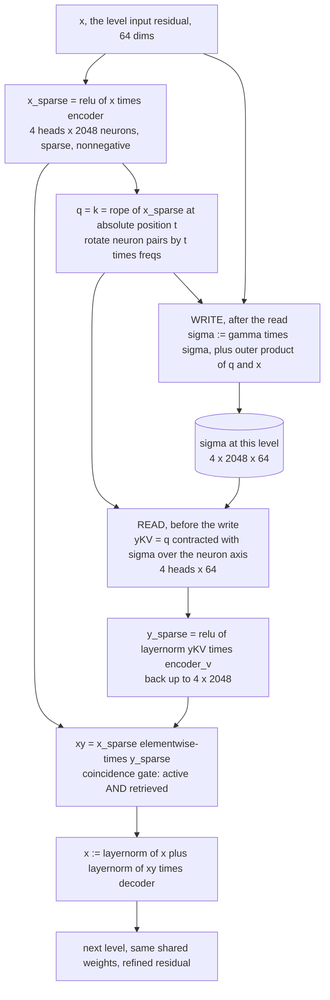
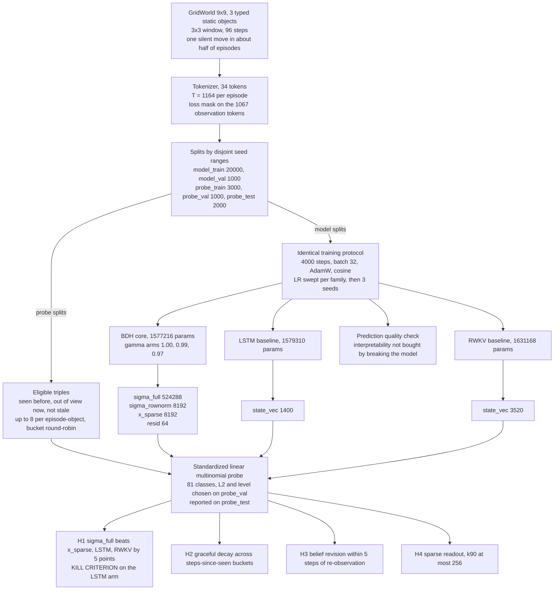

# HBWM Explainer: what this project studies, how it works, and what it found

This document is the long-form companion to [README.md](../README.md) (how to run things) and
[RESULTS.md](../RESULTS.md) (the numbers). It assumes you know what an LSTM and an attention layer
are, and assumes you have never heard of BDH. Every architectural claim below was checked against
the code in `hbwm/`, and every number comes from `RESULTS.md`, from a config file, or from a
computation you can redo in three lines of Python. Where the design specs and the code disagree,
the code wins, and the disagreement is flagged.

Study 1 produced a preregistered negative result. That is the honest headline, and section 8 states
it plainly before offering any interpretation. Section 8 also carries three post-hoc findings added
after the study closed, clearly labeled as exploratory; they change no preregistered decision, but
they do change how the negative result should be read.

---

## 1. The question and the bet

Every sequence model that runs in constant memory has to put its past somewhere. An LSTM puts it in
a hidden and cell vector. RWKV puts it in a running weighted sum, the `wkv` state. These work. They
are also illegible: nothing in the training objective makes coordinate 47 of an LSTM cell state mean
anything in particular, and in practice it does not.

BDH, "the Dragon Hatchling" ([pathwaycom/bdh](https://github.com/pathwaycom/bdh), MIT, vendored
here at commit `2b0d7a45b058d4309c84a10e0768d541fe18bdc2`), holds its memory differently. Its
per-token computation projects a small dense residual into a large, sparse, strictly nonnegative
space whose coordinates behave like firing units, and its memory accumulates as an outer product of
those units with a value vector. That is a Hebbian update: the state is a matrix that accumulates a
signed outer product of what is active with what is being carried, rather than a vector whose
entries are overwritten by a gate. (Sections 3 and 4 give the exact write; "grow together" is the
right intuition but the wrong arithmetic, because the value factor is signed.)
Crucially, the axis those memories are indexed by is not a learned key projection; it is the model's
own activation code, which is why it is even plausible that its entries mean something.

The bet this repository tests is a specific consequence of that structure:

> If memory lives in the connections between concept-like neurons, then a specific, findable part
> of the state should mean "the object of type 2 is bound to position (3, 5)". A belief state built
> out of associations should be addressable and human-readable in a way that a hidden vector is not.

That is an empirical claim, and it can fail. Study 1 sets up the smallest honest test of it: train
a BDH and two parameter-matched conventional baselines to predict observations in a partially
observed gridworld, then ask a linear probe to read the location of an out-of-view object out of
each model's internal state. If the bet is right, the probe should do markedly better on BDH's
synapse state than on an LSTM's hidden vector. The rules for deciding that, including a kill
criterion, were fixed in a commit before any headline run.

---

## 2. The BDH forward pass, line by line

The reference configuration for this study is $D = 64$ (residual width), $n_h = 4$ (heads),
$N = 2048$ (neurons per head), $L = 6$ levels, vocabulary $V = 34$, block size $T = 1164$. Read
along with `hbwm/bdh/upstream/bdh.py` (vendored, never edited) and `hbwm/bdh/core.py`.

Here is one level of the forward pass for a single token at absolute position $t$, batch dimension
dropped, in the recurrent form that `HBWMCore.step` implements:

```text
# x : [D=64]                          the residual stream entering this level
x_sparse = relu(x . encoder)          # [nh=4, N=2048]   encoder   : [4, 64, 2048]
q = k    = rope(x_sparse, t)          # [4, 2048]        same tensor, rotated by absolute t
yKV      = sum_{s < t} gamma^(t-1-s) * dot(q_t, k_s) * v_s      # [4, 64]   v_s = the residual at s
y_sparse = relu(ln(yKV) . encoder_v)  # [4, 2048]        encoder_v : [4, 64, 2048]
xy       = x_sparse * y_sparse        # [4, 2048]        elementwise
yMLP     = xy.reshape(4 * 2048) . decoder                       # [64]      decoder : [8192, 64]
x        = ln(x + ln(yMLP))           # [64]             input to the next level
```

After the last level, `logits = x . lm_head` with `lm_head : [64, 34]`.

**`x_sparse = relu(x . encoder)`.** A 64-dimensional dense residual becomes a
$4 \times 2048$ nonnegative, sparse code. The relu is load-bearing: it is what makes these
coordinates behave like units that are either firing or silent, rather than like signed
projections. Everything downstream that talks about "neurons" means these 8,192 numbers.

**`q = k = rope(x_sparse, t)`.** This is the line that makes BDH unusual. There is no learned query
projection and no learned key projection. Upstream asserts it: `assert K is Q` in
`Attention.forward`. Queries and keys are literally the same tensor, differing only in the position
they are rotated by. The consequence is that two tokens interact exactly when their neuron codes
overlap after rotation:

$$\text{score}(t, s) \;=\; \langle R(t)\,u_t,\; R(s)\,u_s \rangle \;=\; \langle u_t,\; R(s - t)\,u_s \rangle,
\qquad u_t = \mathrm{relu}(x_t W_{\mathrm{enc}})$$

where $R(\cdot)$ is the RoPE rotation. Note what the rotation buys: $u_t$ and $u_s$ are both
nonnegative, so without it every score would be nonnegative and attention could only ever add. The
rotation is the sole source of sign and of position dependence in the interaction. `get_freqs`
quantizes frequencies in pairs with $\theta = 2^{16}$, and the resulting `Attention.freqs` buffer has
shape `[1, 1, 1, N]`, so **every head uses the identical frequency schedule**; the variation is along
the neuron axis, not across heads. That axis spans an enormous range of angular speeds: the fastest
pair turns 1.0 radian per token, about 185 full turns across a 1,164-token episode, while 1,082 of
the 2,048 coordinates do not complete even one turn over the whole episode. Part of the neuron axis
is a fast clock and part of it is nearly static.

**The attention itself.** In the parallel path, `scores = (QR @ QR.mT) * decay_mask` and
`y = scores @ V`. Three things to notice:

- **No softmax.** The scores are unnormalized inner products. They can be negative and their scale
  is free to grow with context length.
- **Strictly causal.** Upstream uses `.tril(diagonal=-1)`, and `HBWMCore` replaces it with a decay
  mask $M[t, s] = \gamma^{\,t - 1 - s}$ for $s < t$, zero otherwise. The diagonal is excluded, so a
  token never attends to itself. At $\gamma = 1$ the mask is exactly upstream's `tril(-1)`, which is
  why the primary arm is upstream-faithful.
- **`V = x` is the residual itself, shared across heads.** Upstream keeps `V` at shape
  `[B, 1, T, D]` and broadcasts it across the head axis. There is no value projection either. Every
  head reads from the same 64-dimensional value stream.

**`y_sparse = relu(ln(yKV) . encoder_v)`.** The retrieved value is 64-dimensional. This line
projects it back *up* into the 2,048-per-head neuron space through a second encoder, with another
relu. So memory comes back addressed in the same vocabulary the token was encoded into.

**`xy = x_sparse * y_sparse`.** This is the crux of the architecture. It is an elementwise product
of the bottom-up code (what this token activates right now) with the top-down code (what memory
returned). Neuron $n$ of head $h$ contributes to the output only if it is **both** currently active
**and** retrieved from memory. Both factors are nonnegative, so this is a coincidence gate: it is
the closest thing in the whole architecture to "an association firing". If you want an intuition for
why anyone would expect BDH's state to be legible, this line is it.

**`yMLP` and the residual update.** The gated code is flattened to $n_h N = 8192$ and projected
back down to $D = 64$ by `decoder`, then folded into the residual with two LayerNorms
(`elementwise_affine=False`, so they carry no parameters). Dropout of 0.1 is applied to `xy` in
training mode only.

**The six levels share one set of weights.** `share_layers=True` is the default and is used
throughout Study 1: a single `encoder`, `encoder_v` and `decoder` are applied six times to a
progressively refined residual. This has two consequences that matter for everything below. First,
the same block runs six times over *different* residual streams, so there are **six distinct
$\sigma$ matrices per sequence**, one per level, not one. Second, depth is free: the parameter count
does not depend on `n_layer` at all.

$$3 \, n_h D N \;+\; 2 V D \;=\; 3 \cdot 4 \cdot 64 \cdot 2048 \;+\; 2 \cdot 34 \cdot 64
\;=\; 1{,}572{,}864 + 4{,}352 \;=\; \mathbf{1{,}577{,}216}$$

The three terms of $3 n_h D N$ are `encoder`, `encoder_v` and `decoder`, each exactly 524,288
parameters. The $2VD$ term is the embedding and the language-model head. `tests/test_core_forward.py`
asserts the sharing directly: an unshared six-level model has exactly $3 n_h D N \cdot (L - 1)$ more
parameters.

One last detail with large consequences for section 4: at level 0 the residual is just
`ln(embed(token))`. It is a pure function of the token id, with no context in it at all. Context
enters only through depth.



---

## 3. Where sigma comes from

Everything in this project rests on one identity: the parallel attention form above is exactly a
recurrent state update. Start from the masked, softmax-free attention output at position $t$:

$$y_t \;=\; \sum_{s<t} \gamma^{\,t-1-s}\,(q_t \cdot k_s)\, v_s
\;=\; q_t^{\top} \Big( \sum_{s<t} \gamma^{\,t-1-s}\, k_s \otimes v_s \Big)
\;=\; q_t^{\top} \sigma_t$$

The middle step is just moving the scalar $q_t \cdot k_s$ inside and regrouping. Define

$$\sigma_t \;=\; \sum_{s<t} \gamma^{\,t-1-s}\, k_s \otimes v_s
\qquad \Longrightarrow \qquad
\sigma_{t+1} \;=\; \gamma\,\sigma_t \;+\; k_t \otimes v_t$$

That is the Hebbian rule. Read before you write at each step and you reproduce `tril(diagonal=-1)`
exactly, because $\sigma_t$ contains only contributions from $s < t$. `HBWMCore.step` implements
precisely this, in that order, with a `plasticity` knob that Study 1 never uses at anything but
`full`.

**The knob gates the whole update by mode, not by $\alpha$.** This is easy to get wrong, so state it
exactly as `hbwm/bdh/core.py::step` has it. The mode picks
$\alpha \in \{1.0\ (\texttt{full}),\ 0.0\ (\texttt{frozen}),\ \text{arbitrary}\ (\texttt{scaled})\}$,
but the decay-and-write block is guarded by `if plasticity != "frozen"`:

- `frozen` skips the block **entirely**, so $\sigma$ is left bit-identical to its value on entry:
  no decay and no write. The belief is held, not merely frozen against new evidence.
- `full` and `scaled` both apply `sigma.mul_(gamma)` first, then add $\alpha\,(q \otimes x)$. So
  `scaled` with `plasticity_scale = 0.0` still decays $\sigma$ by $\gamma$ even though it writes
  nothing, which is a different state from `frozen` whenever $\gamma < 1$.

At $\gamma = 1$ the two conventions coincide, which is why
`tests/test_core_step.py::test_plasticity_modes_gamma_0_9` exists: it pins all three behaviors at
$\gamma = 0.9$, where they are distinguishable.

**Shapes, plainly.** With $k_s$ living in neuron space and $v_s$ in residual space, $\sigma$ is
$[n_h = 4,\ N = 2048,\ D = 64]$ per level. `init_state` allocates
$[L, B, n_h, N, D]$. For one episode that is $6 \cdot 4 \cdot 2048 \cdot 64 = 3{,}145{,}728$ fp32
values, **about 12.6 MB**.

**The correction that matters: $\sigma$ is not a 2048x2048 neuron-to-neuron matrix.** It is easy to
read "synaptic memory between neurons" and picture a square connectivity matrix. The state is not
that. Its second axis is neurons and its third axis is the 64-dimensional residual, because
upstream's values are the residual stream, not another neuron code. The square picture is a
*derived view*:

$$\tilde{\sigma} \;=\; \sigma \cdot W_{\mathrm{enc\_v}} \;\in\; \mathbb{R}^{N \times N},
\qquad \operatorname{rank}(\tilde{\sigma}) \le D = 64$$

A 2048x2048 matrix of rank at most 64. `HBWMCore.synapse(sigma_level, level, head, rows, cols)`
computes any submatrix of it lazily and the full $N \times N$ is never materialized anywhere in the
codebase. (The Study 1 design spec mentions a `materialize=True` escape hatch on this method. There
is no such argument in the code; the spec is stale on that point.)

**Why the equivalence is a test, not a comment.** Training uses the parallel form, because one
`[T, T]` score matrix is far faster than 1,164 Python-level steps. Every probe feature and every
belief heatmap uses the recurrent form, because that is the only path where $\sigma$ exists as a
tensor you can index. If the two paths were not the same function, every probe number would describe
a model that was never trained. So the repo pins them together with tests
(`tests/test_core_forward.py`, `tests/test_core_step.py`, CPU, fp32, tiny config, eval mode):

| check | test | tolerance |
|---|---|---|
| `HBWMCore.forward` at $\gamma = 1$, shared layers, vs. unmodified upstream `BDH.forward` | `test_core_forward.py::test_forward_bit_identical_to_upstream_at_gamma_1` | bit-identical (`torch.equal`) |
| `forward` logits vs. sequential `step()` logits, $\gamma \in \{1.0,\ 0.9\}$ | `test_core_step.py::test_step_matches_forward` | `atol = 1e-4` at **both** $\gamma$ values |
| $\sigma$ after $t$ steps vs. the closed form above, $\gamma = 0.8$ | `test_core_step.py::test_sigma_closed_form` | `atol = 1e-5` |
| `frozen` leaves $\sigma$ untouched, decay included | `test_core_step.py::test_plasticity_modes_gamma_0_9` | bit-identical |
| `scaled` with scale $s$ produces exactly $s$ times the `full` write, on top of the same decay | `test_core_step.py::test_plasticity_modes_gamma_0_9` | `atol = 1e-6` |
| the vendored `bdh.py` file hash vs. the hash recorded in `UPSTREAM.md` | `test_upstream.py::test_upstream_file_unmodified` | exact |

The last row is what keeps "upstream, untouched" from being a claim in prose.

Note that the first two rows are **different pairs of paths** and it is worth not collapsing them.
Row 1 compares this repo's parallel `forward` against upstream's parallel `forward`; that one is
bit-identical, and only at $\gamma = 1$. Row 2 compares this repo's parallel `forward` against this
repo's recurrent `step()`; that one is a floating-point agreement at `atol = 1e-4`, at $\gamma = 1.0$
and $\gamma = 0.9$ alike. There is no bit-identical parallel-versus-recurrent claim anywhere, and
there could not be: the two paths contract the same sums in different orders.

**The decay knob.** Upstream has no forgetting: the state is a pure sum and RoPE rotates without
damping. Hypothesis H2 needs a horizon knob, so `HBWMCore` adds $\gamma$ through the decay mask
buffer, sized `[block_size, block_size] = [1164, 1164]`. $\gamma = 1.0$ is the preregistered primary
arm and is bit-identical to upstream; 0.99 and 0.97 are secondary arms. Section 5 explains why those
two numbers turned out to mean something much more aggressive than they look.

---

## 4. A worked example: one fact, end to end

Take a concrete episode moment. The agent is at $(x, y) = (3, 5)$ at environment step 12, and an
object of type 0 sits at $(4, 4)$, one cell up and one to the right, so it is inside the 3x3 window.

**The tokens.** Environment step 12 occupies token indices 144 through 155
(`STEP_LEN = 12`, so `base = 12 * 12 = 144`):

| token index | token | meaning |
|---|---|---|
| 144 | `A_E` (id 3) | the action that produced this step |
| 145 | `X_3` (id 9) | agent x coordinate |
| 146 | `Y_5` (id 22) | agent y coordinate |
| 147 | `EMPTY` (id 28) | window cell $(2, 4)$ |
| 148 | `EMPTY` (id 28) | window cell $(3, 4)$ |
| 149 | `OBJ_0` (id 30) | window cell $(4, 4)$, the object |
| 150 to 155 | `EMPTY` (id 28) | window cells $(2,5)$ through $(4,6)$, assuming nothing else is in view |

The window is emitted row-major over `dy` in $(-1, 0, 1)$ then `dx` in $(-1, 0, 1)$, so $(4,4)$
lands at offset 2 of the nine cells. Token index 155 is `obs_positions(96)[12] = 11 + 12 * 12`, and
that is the feature timestep the probes use for environment step 12: the moment the model has just
finished reading the whole observation.

**What happens in $\sigma$ when the `OBJ_0` token is read at $t = 149$.** At level 0:

1. `x = ln(embed(OBJ_0))`, a function of the token id alone.
2. `x_sparse = relu(x . encoder)`, so the neuron pattern for `OBJ_0` is the *same every time* the
   token appears anywhere in any episode.
3. `q = rope(x_sparse, 149)`, that same pattern rotated by absolute position 149.
4. Read: `yKV = q` contracted with $\sigma_0$, which at this instant holds writes from positions 0
   through 148 (including `X_3` at 145 and `Y_5` at 146).
5. Write: $\sigma_0 \leftarrow \sigma_0 + q \otimes x$, an outer product of a rotated `OBJ_0` code
   with the `OBJ_0` embedding.

So **level 0's $\sigma$ is a rotation-tagged bag of token embeddings**. It contains nothing about
(3, 5) whatsoever, because neither its key nor its value has seen any other token. Binding can only
happen deeper: the level-1 residual at position 149 is `ln(x + ln(yMLP))` where `yMLP` was built
from the coincidence gate `x_sparse * y_sparse`, and `y_sparse` came from what level 0 retrieved out
of $\sigma_0$, which includes the `X_3` and `Y_5` rows written four and three tokens earlier. By
levels 3 and 4 the value being written is several rounds of that mixing deep. Empirically this is
where the signal lives: the best `sigma_full` level chosen on validation data was L3 for eight of
the nine BDH checkpoints and L4 for the ninth. That could be an artifact of `sigma_full` only being
probed at three candidate levels, except that `sigma_rownorm`, which is probed at all six, also
selects L3 or L4 for every one of the nine checkpoints and never L0, L1, L2 or L5.

**Now the pedagogical point.** It is tempting to expect that after this write there is an entry
`sigma[object_neuron, cell_neuron]` that has gone up. There is not, and there cannot be, for three
reasons:

- The write is $q \otimes x$, an outer product of a *rotated* neuron code with a
  *64-dimensional contextual residual*. Nothing in the objective forces the "which object" part and
  the "which cell" part into separate factors of that product. They arrive already entangled in a
  64-dimensional vector.
- The rotation depends on the absolute position 149. The same fact written at a different step lands
  in a different rotational phase, so two writes of the same fact do not simply add.
- Retrieval requires presenting the right query. The only way $\sigma$ releases what it stored at
  149 is a contraction $q'^{\top}\sigma$ for some $q'$ whose neuron pattern overlaps $R(149)u_{149}$.
  There is no coordinate you can look up.

$\sigma$ is **content-addressable memory, not a picture**. That distinction is the whole reason
Study 1 could fail without the architecture being wrong.

The repo's exploratory tooling makes this explicit rather than hiding it. `hbwm/instrument/atlas.py`
builds a "concept atlas" with **two** index sets per level, not one: a `token` atlas, the top-32
neurons per head by mean `x_sparse` when a given token is read, and a `cell` atlas, the top-32
neurons per head by mean `x_sparse` when the agent is standing on a given grid cell at the end of an
observation. `hbwm/instrument/belief.py` then renders a belief map by summing entries of the low-rank
synapse view $\tilde\sigma$ between the **cell** atlas rows for $(x, y)$ and the **token** atlas
columns for `OBJ_k`, plus the transposed term.

That is a *hypothesis* about which index sets carry the association, not a structural guarantee.
Nothing in training makes those the right rows and columns. `belief.py` says so in its own module
docstring, and the heatmaps it produces are labeled exploratory and not preregistered.

**Third code-versus-spec divergence, flagged as promised.** The Study 1 design spec specifies token
atlases on both axes of the belief map. The code uses the per-cell atlas for the row axis. The code
wins, as everywhere else in this document, but the heatmaps in section 8 should be read as the
per-cell construction, which is a strictly different object from the one the spec describes. (The
other divergences are the absent `materialize=True` argument on `synapse()`, the `OBJ_0..OBJ_3`
versus `OBJ_1..OBJ_4` token naming, and the `sigma_full` feature cache in section 6, which the spec
budgets one level at a time and the code opens all at once.)

---

## 5. The environment, and why each choice

`hbwm/envs/` implements a 9x9 gridworld with 3 static objects of distinct types, a 3x3 observation
window, 96 actions per episode, tokenized into a fixed 34-token vocabulary at $T = 1164$ tokens per
episode. Every choice below is stated with what would have gone wrong without it.

| choice | rationale | what would have gone wrong |
|---|---|---|
| 9x9 grid, 81 cells | the probe target is a single 81-way classification, and `sweep` covers every cell in at most 96 moves | a bigger grid makes exhaustive coverage impossible in 96 steps, so "never seen" and "forgotten" become confounded |
| 3x3 window | partial observability is the entire reason a belief state is needed; the agent sees at most 9 of 81 cells at a time, and fewer when it stands on an edge or in a corner, where the out-of-grid window slots are emitted as `WALL` | full observability leaves nothing to remember and the study has no subject |
| 3 objects of **distinct** types, drawn from 4 | "the object of type $k$" names a unique object, so the probe label is unambiguous | with repeated types the label would be ambiguous, and a probe failure could be a labeling artifact rather than a memory result |
| agent's absolute $(x, y)$ in every observation | isolates object memory from self-localization | without it, a failed probe could always be blamed on the model not knowing where *it* is, and the hypothesis would never get a clean shot |
| static objects | ground truth is unambiguous, and the oracle-memory baseline (predict the last-seen cell) is exactly 1.000 by construction | drifting objects put the ceiling below 1 and make every accuracy number relative to a moving reference |
| the silent move | tests belief **revision**, not just storage | storage alone is a weak test: a model could pass by never updating anything |
| `stale` exclusion | after a silent move the true answer is genuinely unknowable to the agent | scoring those steps would punish a model for holding the correct belief given its evidence |
| 96 environment steps | long enough to populate the 65+ steps-since-seen bucket (662 test pairs), short enough that $T = 1164$ fits one parallel attention pass | shorter and the long-horizon buckets are empty; longer and the `[T, T]` score matrix gets expensive fast |
| three policies in equal thirds | `sweep` guarantees every object is seen at least once, `random_walk` produces long gaps, `waypoint` produces structured revisits | a single policy confounds memory horizon with one particular coverage pattern |
| loss on observation tokens only | predicting the agent's own action is not world modeling | including action tokens lets a model score well by learning the policy instead of the world |

**The silent move, in detail** (`hbwm/envs/episode.py`). With probability 0.5, at one step drawn
uniformly from $[\lceil 0.25 L \rceil, \lfloor 0.75 L \rfloor] = [24, 72]$, one object that is *not
currently in view* teleports to a uniformly random empty cell that is *also* out of view. At most
one move per episode, and the agent receives no signal until it re-observes the object. Measured on
the 2,000-episode `probe_test` split: 1,041 episodes contain a move (**0.5205** of all episodes), and
the moved object is re-observed before the episode ends in 622 of them. That is **0.311 of all
episodes** and **622 / 1041 = 0.598 of moved episodes**; the two denominators are easy to confuse and
only the second is the conditional re-observation rate. Those 622 re-observed episodes are the ones
H3 scores.

**Tokenization.** The vocabulary is 34 tokens and is grid-size independent up to `MAX_G = 11`
(`hbwm/envs/tokenizer.py` reserves `X_0..X_10` and `Y_0..Y_10`, so a grid larger than 11x11 would
need a larger vocabulary):
`BOS`, `PAD` (reserved, unused), `A_N/A_E/A_S/A_W`, `X_0..X_10`, `Y_0..Y_10`, `EMPTY`, `WALL`,
`OBJ_0..OBJ_3`. Note the object tokens are `OBJ_0` through `OBJ_3` in the code
(`OBJ_BASE = 30`, ids 30 to 33); the Study 1 design spec calls them `OBJ_1..OBJ_4` and is stale.

```text
sequence : BOS, o_0, a_1, o_1, a_2, o_2, ..., a_96, o_96
o_t      : [X_x, Y_y, c_0, c_1, ..., c_8]        11 tokens, window row-major
T        = 1 + 11 + 12 * 96 = 1164
```

The loss mask is `True` on all $97 \times 11 = 1067$ observation tokens and `False` on `BOS` and the
96 action tokens.

**The consequence nobody should skip.** One environment step is 12 tokens (`STEP_LEN = 12`: one
action plus an 11-token observation), and $\gamma$ decays **per token**, not per environment step.
So the named decay values mean something much sharper than they look:

| named $\gamma$ | per environment step $\gamma^{12}$ | half-life in environment steps |
|---|---|---|
| 1.00 | 1.000 | infinite |
| 0.99 | 0.886 | about 5.7 |
| 0.97 | 0.694 | about 1.9 |

A $\gamma = 0.97$ arm forgets half of a memory in under two environment steps. This is recorded as
a required caveat in RESULTS.md and is the single clearest thing this study would change on a
rerun: apply decay per environment step so a named $\gamma$ means what it appears to mean.

**Splits by disjoint seed ranges** (`hbwm/envs/dataset.py`), so no episode is ever shared between
model training and probing: `model_train` 20,000, `model_val` 1,000, `probe_train` 3,000,
`probe_val` 1,000, `probe_test` 2,000. Without this a probe could be reading memorized training
episodes rather than a belief state.

---

## 6. How "readable" becomes a number

**The target.** For a triple (episode, environment step $t$, object $k$), predict the object's true
cell id in $\{0, \ldots, 80\}$. That is 81 classes. Reported chance is the majority-class rate: the
frequency, in the test set, of whichever cell was most common in the training set, **0.011**,
marginally below the uniform $1/81 = 0.0123$. The oracle-memory ceiling
(predict the cell where the object was last seen) is **1.000 by construction**, because eligibility
excludes stale pairs and static objects never move. The ceiling is reported for completeness and is
not an informative baseline.

**The eligibility rule** is one line in `hbwm/probes/eligibility.py`:

```python
(d.steps_since_seen >= 1) & ~d.visible & ~d.stale
```

Each clause earns its place:

- `steps_since_seen >= 1`: the object has been seen at least once before, so there is something to
  remember. Without this the task would sometimes be unanswerable from any state.
- `~visible`: the object is not in the current 3x3 window. Without this the answer is sitting in the
  observation the model just read, and the probe would measure perception, not memory. (This clause
  is formally redundant with the first, since `steps_since_seen == 0` exactly when the object is
  visible. It is there as belt and braces.)
- `~stale`: the pair is not between a silent move and its re-observation. In that interval the
  correct belief is the *old* cell but the labeled truth is the *new* one, so scoring there would
  penalize a model for being right about its evidence.

**Sampling.** Up to 8 eligible steps are drawn per (episode, object), round-robin across the
steps-since-seen buckets 1-4, 5-8, 9-16, 17-32, 33-64 and 65+, so that long-horizon pairs are not
swamped by the far more numerous short-horizon ones. This yields 61,400 `probe_train` pairs and
41,039 `probe_test` pairs (11,660 / 10,985 / 9,204 / 5,716 / 2,812 / 662 by bucket).

**Why a linear probe specifically.** Linear decodability is the standard operationalization of
"explicitly encoded". A deep probe answers a different and much weaker question, "is the information
recoverable from this state at all", to which the answer is nearly always yes and which says nothing
about format. The cost of that choice has to be stated honestly, and it is the pivot point of this
whole project: **a linear null is a null about format, not about content.** Section 8 returns to
this, and Study 2 is designed around it.

**Standardization.** Every feature is standardized before the linear layer: per-feature mean and
standard deviation fitted on `probe_train` only, with std below 1e-6 mapped to 1.0 so near-constant
features map to 0 rather than having their noise amplified. The same transform is applied to all
four BDH feature sets and to both baseline state vectors, in training and in the streamed validation
and test passes. Two reasons: $\sigma$ entries and `x_sparse` activations live on wildly different
scales, so a shared L2 penalty would otherwise mean different things per feature set; and H4 ranks
features by probe-weight norm, which is only a meaningful comparison if the features share a scale.

**The feature sets** (all BDH features are per level, heads concatenated; the timestep for every
model including baselines is the last token of observation $o_t$):

| name | dims | meaning |
|---|---|---|
| `sigma_full` | $n_h N D = 524{,}288$ | the flattened synapse state at one level |
| `sigma_rownorm` | $n_h N = 8{,}192$ | L2 norm of each neuron's $D$-vector row of $\sigma$, a "synaptic load" summary that is largely insensitive to rotational phase (exactly phase-invariant only for the sum of squared row norms across a rotated coordinate *pair*, as spelled out in section 8) |
| `x_sparse` | $n_h N = 8{,}192$ | the activations-only ablation |
| `resid` | $D = 64$ | the residual stream, a floor |
| `state_vec` (LSTM) | 1,400 | `concat(h_1, c_1, h_2, c_2)` |
| `state_vec` (RWKV) | 3,520 | `[aa, bb, pp, x_prev_timemix, x_prev_channelmix]` over 4 blocks |

**The probe recipe.** Linear multinomial logistic regression, no hidden layer, Adam lr 1e-3, 20
epochs, batch 512, L2 in $\{10^{-4}, 10^{-3}, 10^{-2}, 10^{-1}\}$ selected on `probe_val`, reported
on `probe_test`, with a 95% bootstrap CI resampled over test episodes. `sigma_rownorm`, `x_sparse`
and `resid` are probed at all 6 levels; `sigma_full` at up to 3 levels (the two best by
`sigma_rownorm` validation accuracy, plus the last level), because probing all six at 524,288
features is not affordable. Best level is always chosen on `probe_val`.

**The budget asymmetry, stated up front.** Feature sets of at most 16k dims use all 61,400
`probe_train` pairs, cached in RAM. `sigma_full` trains on a **stratified 24,000-example
subsample**, cached as fp16 memmaps on disk (deleted in a `finally` block), with validation and test
streamed so those features are never cached. The asymmetry was preregistered, is visible in the
`n_train` column of every results table, and is one of the three candidate explanations for the
negative result in section 8.

**How much scratch that actually is, and the incident it caused.** Not one level at a time. In
`hbwm/probes/run.py` the `sigma_full` stage calls `fit_and_eval_stage` **once**, with every selected
level in `specs_full` and `memmap_specs=tuple(specs_full)`, and `collect_many` opens one memmap per
spec up front and fills them all in the same streaming pass over the recorder. So every selected
level's cache is open concurrently. One level is $24{,}000 \times 524{,}288$ fp16, about **25 GB**;
Study 1 selects three levels under `full_levels="auto"` (the two best by `sigma_rownorm` validation
accuracy, plus the last level), so the peak is roughly **75 GB of scratch disk**, not 25.

**Fourth code-versus-spec divergence, flagged as promised.** The Study 1 design spec says the
`sigma_full` train cache is written "one level at a time (about 25 GB per level, deleted after use)".
The code does not do that. Sharing one recorder pass across all three levels is the obvious reason to
write it this way, and the code's own comments record the per-level size, but the three-level peak is
not what the spec budgets for. As everywhere else in this document, the code wins.

That three-level peak is the likely cause of the memory incident RESULTS.md already reports under its
wall-clock caveats: "One probe run was OOM-killed and re-run after memory fixes." Anyone rerunning
the matrix should budget for the three-level peak, or pass an explicit single-level `full_levels` and
accept the extra recorder passes.

---

## 7. The controls, which is where the science lives

A probe accuracy on its own means nothing. The value of this study is in what each control rules
out.

| control | the alternative explanation it kills | outcome |
|---|---|---|
| Parameter-matched LSTM ($H = 350$, 1,579,310 params, +0.13%) and RWKV ($C = 176$, 1,631,168, +3.42%), both inside the preregistered +/- 5% band | "0.10 is just what anything gets on this task; the task is too hard" | killed, and it went the wrong way: the baselines reached 0.171 and 0.218 |
| The `x_sparse` ablation: the same probe, same timestep, same standardization, on activations instead of synapses | "BDH knows the answer, but in its activations, not in its synapse state" | `x_sparse` reached 0.062, below `sigma_full`'s 0.101, so the synapse state is **more linearly decodable** than the activations, just not by the required margin. Note this is a decodability comparison, not a content claim (section 8's own rule), and the two arms are not matched: 524,288 features from 24,000 examples against 8,192 from 61,400 |
| The `resid` feature, 64 dims | sets a floor for what a tiny readout gets | 0.040, above chance, well below everything else |
| Per-model LR sweep over 3e-4, 1e-3, 3e-3 at seed 0, then 3 seeds at the argmin | "you picked a bad learning rate for the baseline" and "that is one seed of noise" | all three families selected 3e-3; the maximum within-arm spread of best validation CE across seeds is 0.0020 nats |
| Identical training protocol: same data, 4,000 steps, batch 32 whole episodes, AdamW (0.9 / 0.95, weight decay 0.1), 200 warmup steps then cosine to 0.1x, grad clip 1.0, fp32, masked CE, eval every 200 steps, best-val checkpoint | "the baselines got a better recipe" | every optimization hyperparameter matched. One architectural knob is **not** matched and should be stated: the BDH configs set `dropout: 0.1` (applied to `xy` in training mode), the LSTM config sets `dropout: 0.0`, and the RWKV baseline has no dropout at all. If anything that regularizes BDH more than its comparators |
| The prediction-quality table, test CE on `probe_test` episodes the models never trained on | "the interpretability was bought by breaking the model" | killed: BDH 0.0246 beats the LSTM's 0.0291 and is level with RWKV's 0.0242 (marginally behind it, and behind on val CE too) |
| Disjoint seed ranges for every split | "the probe is reading memorized training episodes" | structurally impossible |
| Parallel/recurrent equivalence tests (section 3) | "the instrumented model is not the trained model" | `forward` versus sequential `step()` agree to `atol = 1e-4` at $\gamma = 1.0$ **and** at $\gamma = 0.9$. Separately, and on a different pair of paths, `forward` at $\gamma = 1$ is bit-identical to upstream `BDH.forward` |
| Preregistration with a named kill criterion, commit `e674b1da138f905670dde5571e1a1890b134fe36`, before any headline run | "you found the story that fit the data" | the rule that fired is the one written down in advance |

The preregistration is the control that does the most work, and specifically the kill criterion:
**"H1 fails against the LSTM state"** was written down as the condition under which the project
stops or pivots rather than continues tuning. That is a commitment made when the author did not know
which way the result would go, and it is what makes the negative result in section 8 evidence rather
than an anecdote.



---

## 8. Results and honest interpretation

### The numbers

Probe accuracy on `probe_test`, best level per seed, mean over 3 seeds. Reproduced from
[RESULTS.md](../RESULTS.md), with the standard deviation split into its own column.

| model | feature | accuracy | std over seeds | features | n_train |
|---|---|---|---|---|---|
| bdh_g100 | `sigma_full` | **0.101** | 0.007 | 524,288 | 24,000 |
| bdh_g100 | `sigma_rownorm` | 0.172 | 0.008 | 8,192 | 61,400 |
| bdh_g100 | `x_sparse` | 0.062 | 0.009 | 8,192 | 61,400 |
| bdh_g100 | `resid` | 0.040 | 0.005 | 64 | 61,400 |
| lstm | `state_vec` | 0.171 | 0.006 | 1,400 | 61,400 |
| rwkv | `state_vec` | 0.218 | 0.007 | 3,520 | 61,400 |

Chance 0.011, oracle ceiling 1.000.

**H1: not supported, and the kill criterion fired.** `sigma_full` beats `x_sparse` by only +0.039,
short of the required 5-point margin, and loses outright to the LSTM state by -0.070 and to the RWKV
state by -0.117, with every paired-by-seed difference against both baselines negative. The
preregistered kill condition was "H1 fails against the LSTM state". It did. The preregistered
response applies: write it up and pivot rather than keep tuning Study 1.

**H2 (graceful decay): passes for $\gamma = 1.0$ only, and the pass is weak.** The
$\gamma = 1.0$ arm satisfies the rule with acc(33-64) / acc(1-4) = 0.85
and no bucket below half its predecessor. Both other $\gamma$ arms fail (0.12 and 0.13) and so do
both baselines (0.08 and 0.09). But the honest reading, recorded post-hoc in RESULTS.md, is that the
$\gamma = 1.0$ curve is flat because the signal is uniformly weak (0.08 to 0.12 across all six
buckets), not because memory is robust. Meanwhile the baselines fail H2 by being *good* at short
horizons: RWKV reads 0.322 in the 1-4 bucket and decays to 0.010 by 65+.

**H3 (belief revision): not supported for any BDH arm.** The fraction of moved-and-re-observed
episodes whose belief flips to the new cell within 5 steps is 0.157 ($\gamma = 1.0$), 0.300
($\gamma = 0.99$), 0.352 ($\gamma = 0.97$), all below the preregistered 0.7 bar, while both
baselines pass easily at 0.940 and 0.953.

**H4 (sparse readout): not supported for BDH.** Median $k_{90}$ is 524,288, the full feature count,
for every BDH arm: none of the sparse budgets that were tested reached 90% of full accuracy. Both
baselines are strongly sparse at median $k_{90} = 256$.

That statement needs the caveat RESULTS.md attaches to it. Only six proper budgets were tried,
$k \in \{16,\ 64,\ 256,\ 1{,}024,\ 4{,}096,\ 16{,}384\}$ (`h4_ks` in `hbwm/probes/run.py`), and the
largest is 16,384, which is only **3.1% of the 524,288 features**. The grid's terminal point is
$k = \text{all}$, so `k90 = n_features` is a **fallback by construction**, not a measurement that
some subset of size 100,000 was tried and failed. Everything between 3.1% and 100% is unprobed. The
strong ($k_{90} \le 256$) and weak ($k_{90} \le 1\%$) verdicts are unaffected by that gap, because
both thresholds sit below 16,384 and were missed outright.

**Prediction quality: BDH is equal or better than the LSTM, and level with RWKV.** Test masked CE on
held-out `probe_test` episodes:

| model | val CE | test CE | test CE (window cells only) |
|---|---|---|---|
| bdh_g100 | 0.0242 | **0.0246** | 0.0250 |
| bdh_g099 | 0.0244 | 0.0249 | 0.0253 |
| bdh_g097 | 0.0268 | 0.0274 | 0.0284 |
| lstm | 0.0284 | 0.0291 | 0.0305 |
| rwkv | 0.0238 | 0.0242 | 0.0246 |

So BDH out-predicts the LSTM it loses to on every single probe hypothesis, and is a hair behind RWKV
(0.0246 against 0.0242 on test, 0.0242 against 0.0238 on validation) rather than ahead of it. The
interpretability was not bought by breaking the model; there was nothing broken to buy it with.

Figures: `docs/figures/h2_curves.png`, `docs/figures/h4_curves.png`, and two exploratory belief
heatmaps, `docs/figures/belief_ep0_t48.png` and `docs/figures/belief_ep1_reobs_t34.png`.

### Interpretation (labeled as interpretation)

Everything from here to the end of this section is post-hoc reasoning, not a preregistered finding,
and none of it changes a verdict above.

There are three candidate explanations for why a flat linear probe reads $\sigma$ so poorly, and
they are not mutually exclusive.

**(i) The format is associative and a flat probe addresses it wrongly.** The architecture never
reads $\sigma$ flatly. It reads it by contracting a sparse, positive query along the neuron axis:
$y_{\mathrm{KV}}[h, d] = \sum_n q[h, n]\,\sigma[h, n, d]$. A flat probe has to learn one free
coefficient for every $(h, n, d)$ triple, 524,288 per class and 42,467,328 in total, when the thing
it is trying to read is specified by a query direction over neurons and a value direction over $D$.
Content addressed by a query vector is precisely the structure a flat readout is worst at
estimating.

**(ii) RoPE smears each write by absolute time.** Every write is $R(s)\,u_s \otimes x_s$. Two writes
of the same fact at different positions $s$ land in different rotational phases, so no single fixed
weight matrix can add them coherently. And this is uneven along the neuron axis: the fastest
coordinate pair turns a full radian per token while 1,082 of 2,048 coordinates do not complete one
turn across the entire episode, so parts of the code are almost phase-free and parts are scrambled
beyond any fixed linear map's ability to realign.

**(iii) Estimation.** 524,288 features estimated from 24,000 examples, against 8,192 features from
61,400 for every comparator. Taken at face value that is 42,467,328 probe weights (524,288 times 81
classes) fitted from 24,000 labeled examples, roughly **1,770 free parameters per example**.

That face value is too pessimistic, and the post-hoc sparsity measurement below (finding (a)) says by
how much. At the selected level 3, $\sigma$'s row-norm participation ratio at the final timestep is
0.050, so on the order of 5% of the 2,048 neuron rows carry the effective mass and roughly 95% of the
524,288 columns are near-constant across examples. Near-constant columns are exactly what the
standardization rule neutralizes: std below 1e-6 maps to 1.0, so those features arrive at the probe
as approximately zero and contribute almost nothing to the fit. The effective feature count is closer
to **26,000**, giving about $26{,}000 \times 81 / 24{,}000 \approx \mathbf{88}$ effective free
parameters per example. That is still worse than any comparator's budget, and 88 per example is still
a hard regime for a flat probe, but it is a factor of twenty milder than 1,770. The estimation story
is **weakened, not eliminated**, and the honest number to quote is 88, not 1,770.

**The corroborating clue.** `sigma_rownorm` reaches 0.172 against `sigma_full`'s 0.101, on a feature
set 64 times smaller, and lands level with the LSTM state's 0.171. The row-norm view is a
deterministic function of $\sigma$, so by construction it cannot contain more information: it
replaces each neuron's 64-dimensional row by a single magnitude
$\|\sigma[h, n, :]\|_2$, collapsing the value direction entirely, and it is largely insensitive to
rotational phase (for a single write, the sum of squared row norms across a rotated coordinate pair
is exactly phase-invariant). A strictly lossy summary beating the full state is the signature that
(i), (ii) and (iii) predict, and it is not what you would expect if $\sigma$ simply had little to
say.

**The alternative, and what is left of it.** The alternative used to be stated as: $\sigma$ at the
probed level may simply carry little precise location information. That is now **half refuted**, and
the refutation is the post-hoc spatial-locality analysis below (finding (b)). An approximate spatial
belief is demonstrably present in $\sigma$. Reading the argmax cell exactly is what fails; landing
near the right cell is something $\sigma$ does three to four times better than its own chance rate,
under a properly per-row computed chance, with the agent-proximity confound controlled.

What survives is a narrower and more useful claim: $\sigma$ at the probed level carries a **blurrier**
spatial belief than the baseline states do, blurrier by enough to fail the exact-cell test that H1
was written around. That is a statement about resolution, not about presence.

Prediction quality still does not rescue the original hypothesis: BDH predicts better than the LSTM,
so belief information demonstrably drives next-token behavior somewhere in the network, but
"somewhere" includes `x_sparse`, the residual stream, and the composition across six levels, not
necessarily $\sigma$ at the one or two levels that were probed.

The exploratory heatmaps were previously offered as consistent with the pessimistic reading, and that
sentence needs qualifying now. At $t = 0$ of episode 1 the three object panels are near-identical
smooth gradients with no object-specific structure, and at the re-observation step of episode 1 the
just-seen object's map is *darkest* exactly where it was seen. Those maps do look dominated by an
object-independent component. But the heatmaps are one hand-built read of $\sigma$ through a
particular pair of atlas index sets, and finding (b) shows a spatial signal that this particular
readout evidently does not surface. The right conclusion from the heatmaps is that **the atlas-based
belief map is the wrong instrument**, not that the belief is absent.

Two things should be kept in proportion. 0.101 is roughly nine times chance on exact cells, and
within-radius-1 is roughly three times chance, so $\sigma$ is not empty. And every decoder here sits
far above chance and far below the 1.000 ceiling, so exact-cell readout of an out-of-view object is
hard for every architecture tested, not only for BDH.

### Three post-hoc findings, and the headline they support

Everything in this subsection is exploratory, descriptive, computed after the fact on saved
artifacts, and changes **no** preregistered decision. Full method and caveats are in RESULTS.md under
"Post-hoc analyses (exploratory, not preregistered)"; the scripts are in `analysis/posthoc/`.

**(a) $\sigma$ is structurally sparse and lowish rank.** Measured on the $\gamma = 1$ seed-0
checkpoint over 64 `probe_test` episodes, at the final timestep, 256 episode-by-head samples per
cell. At level 3, the level the probe independently selected, the participation ratio of $\sigma$'s
row norms is $0.050 \pm 0.014$ of 2,048, so about **103 of 2,048 neuron rows** carry the effective
mass, and 83% of rows sit below 10% of the maximum row norm. Of the 64 singular values,
$10.9 \pm 3.9$ carry 90% of the squared Frobenius mass and 33.2 carry 99%, with a
participation-ratio-of-squared-singular-values of 3.05. `x_sparse` is 81% zero, and the top 1% of
neurons take 8.7% of the total write mass accumulated over an episode. Levels 0 and 5 are sparser
still (participation ratios 1.1% and 2.1%) and lower rank than level 3. From the early snapshot to
the final one, row occupancy *falls* (0.080 to 0.050) while *more* singular values pick up non-trivial
mass ($k_{90}$ 4.24 to 10.94): $\sigma$ concentrates into fewer rows while spreading across more of
the value space. Single checkpoint, not cross-seed.

**(b) The probe's errors are spatially local.** On the 41,039 test rows per seed, three seeds,
identical rows across every spec. Chance is computed per row from the true cell's own neighborhood
size, which shrinks at edges and corners, and averages to 0.097 for within-radius-1:

| spec | exact acc | within-radius-1 acc | chance | mean Chebyshev error |
|---|---|---|---|---|
| BDH `sigma_full` | 0.101 | 0.308 | 0.097 | 2.92 |
| BDH `sigma_rownorm` | 0.172 | 0.403 | 0.097 | 2.44 |
| RWKV `state_vec` | 0.218 | 0.542 | 0.097 | 1.95 |

Every spec beats both a uniform null (expected distance 4.10) and a row-shuffled null (4.03 to 4.07)
under the full predictive distribution, not just the argmax. The obvious confound is controlled and
comes back clean: mean distance from the prediction to the agent is 3.7 to 4.0 cells against 3.81 for
the true object, and predictions land on the agent's own cell only 0.1% to 1.0% of the time, so the
locality is not "guess near the agent".

**(c) BDH fades where the baselines corrupt.** Within-radius-1 accuracy by steps since last seen:

| bucket | BDH `sigma_rownorm` | RWKV `state_vec` |
|---|---|---|
| 1-4 | 0.425 +/- 0.029 | 0.686 +/- 0.005 |
| 33-64 | 0.257 +/- 0.024 | 0.155 +/- 0.003 |

The ordering **inverts** at long horizons. And at the 65+ bucket both baselines' expected error under
the full distribution exceeds that row set's own uniform null, in all three seeds individually
(LSTM 4.609 and RWKV 4.850 against a null of 4.542): a distribution cannot be worse than uniform in
expectation unless it puts systematic mass on the *wrong* cells, so the baselines at very long gaps
are confidently wrong rather than uninformative. BDH's expected error never crosses its null at any
bucket. A Gaussian-blur calibration puts BDH at about 2.9 cells overall, widening to 5 or 6 cells at
the longest gaps, and RWKV at about 2.4 cells overall, widening to about 8 cells by 33-64 and
unmatchable to any blur scale at 65+. The by-bucket exact-match recomputation reproduces RESULTS.md's
H2 table to three decimals, which is the pipeline's own correctness check.

Two caveats belong with (c). The 65+ bucket has 662 rows, shared across seeds rather than
independently drawn, so read it as indicative. And for `sigma_full` specifically the within-radius-1
decay is within noise: a 0.028 drop from bucket 1-4 to 33-64, about one seed standard deviation. The
decay claim rests on `sigma_rownorm` and on the distance-based measures, not on `sigma_full`
accuracy.

**The strongest honest headline the three findings support together.** All three architectures hold
an approximate spatial belief. BDH's is blurrier at short horizons, and that blurriness is exactly
what fails H1, which was written as an exact-cell test. But BDH's belief degrades toward *vagueness*
while the baselines' degrades into *confident error*, and that asymmetry is the one property in this
study that distinguishes the Hebbian state from the recurrent ones in BDH's favor. It is post-hoc,
single-environment, and not what was preregistered. It is also the finding most worth following up.

**Which of these Study 2 separates.** H5 refits a flat linear probe and a family of structured
(low-rank bilinear) readouts on the *same* $\sigma$ with the *same* 24,000 pairs, which separates
(i) plus (iii) from "not there". The `derot_*` families undo $R(t)$ before the readout, which
isolates (ii). H7's `mlp_rownorm` and `mlp_randproj` controls separate "capacity and a
nonlinearity" from "associative structure", because if a plain MLP on the rotation-invariant 8,192
summary matches the best bilinear readout then the bilinear result was about capacity all along.
What Study 2 explicitly cannot do is split format from estimation with H5 alone, which is why H7 is
required reading next to it.

---

## 9. What Study 2 asks and why

Study 2 asks the sharper question Study 1's null leaves open: is the belief information present in
$\sigma$ but written in an associative, query-addressable format that a flat linear probe of 524,288
free parameters cannot estimate from 24,000 examples? It preregisters exactly four rules (H5 to H8)
over readout families whose access pattern matches how the architecture actually reads $\sigma$,
runs every matched family on the LSTM and RWKV states too so the comparison cannot flatter BDH by
construction, and equalizes the training budget at 24,000 pairs for every model and family so
Study 1's asymmetry is removed from the within-study comparison. H6 is the headline and carries its
own kill criterion: if a matched family still fails against the LSTM state, the "sigma as a linearly
or bilinearly readable belief state" line is closed.

Full design: [`docs/superpowers/specs/2026-08-27-hbwm-study2-associative-readout-design.md`](superpowers/specs/2026-08-27-hbwm-study2-associative-readout-design.md).

---

## 10. Reproducing this, and reading the repo

Commands live in [README.md](../README.md#reproduction): `uv sync --extra dev`, then dataset
generation, then `hbwm.matrix --phase {e1,e2,e3,probes}`, then `hbwm.probes.evaluate`.

**Wall-clock, from the artifacts rather than from the estimate.** The design spec guessed one to two
days; the runs say otherwise. Summing `seconds` across the 21 `final.json` files gives
**246,034 s of training (68.3 h)**, and summing `elapsed_s` across the 15 `probes/done.json` files
gives **50,228 s of probing (14.0 h)**, for **82.3 h, about 3.4 days** of background wall-clock on
Apple Silicon (MPS, fp32). Budget **three to four days**. Note that a chunk of that is throttling
rather than work: runs alternated between lid-closed dark-wake and awake operation, which moves
per-run wall-clock by roughly 2x at identical settings.

The `sigma_full` probe stage needs about 25 GB of scratch disk per selected level and opens all
selected levels at once, so budget about 75 GB for the three-level Study 1 default (section 6). The
115-test suite runs on CPU with tiny configs in seconds.

**Module map.**

| path | what is in it |
|---|---|
| `hbwm/bdh/` | `upstream/` (vendored, never edited, hash-pinned by a test), `core.py` (`HBWMCore`, the decay mask, the recurrent `step()`, the lazy `synapse()` view), `state.py` |
| `hbwm/envs/` | `gridworld.py`, `policies.py`, `tokenizer.py`, `episode.py`, `dataset.py` |
| `hbwm/baselines/` | `lstm.py`, `rwkv.py` (chunked WKV), `matching.py` (the parameter-count solver) |
| `hbwm/instrument/` | `recorder.py` (drives `step()` and hands out per-position payloads), `features.py`, `atlas.py`, `belief.py` |
| `hbwm/probes/` | `eligibility.py`, `extract.py`, `probe.py`, `run.py`, `decisions.py` (the H1 to H4 rules as pure functions), `evaluate.py` |
| `hbwm/viz/` | `heatmaps.py`, the CLI that renders the exploratory belief-map frames and animations |
| `hbwm/` | `train.py`, `matrix.py`, `models.py`, `config.py`, `device.py`, `losses.py`, `sanity_shakespeare.py` |
| `analysis/posthoc/` | the three exploratory scripts behind findings (a), (b) and (c) in section 8, read-only on `runs/` and `data/` |
| `experiments/`, `tests/` | the data and training configs; 115 CPU tests, including the equivalence contract and the decision-rule unit tests |

**Where the artifacts live.** `runs/` and `data/` are gitignored and physically live in the sibling
worktree `.claude/worktrees/study1-impl/`. Checkpoints are at
`.claude/worktrees/study1-impl/runs/study1/<model>_lr<lr>/seed<S>/ckpt.pt`, probe outputs under
`.../probes/`, and the aggregated tables and figures under `runs/study1/results/`. The four figures
referenced by RESULTS.md are copied into `docs/figures/` so they survive in the repository. The
preregistration is commit `e674b1da138f905670dde5571e1a1890b134fe36`.
