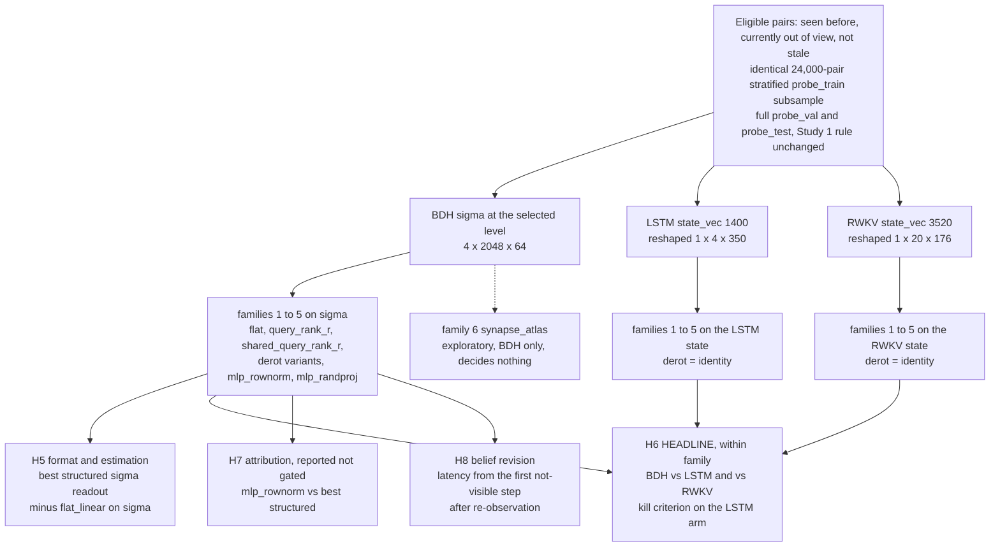

# HBWM Study 2 Detailed Design: Associative Readout of $\sigma$

**Project:** Hebbian Belief-State World Model (HBWM)
**Scope of this document:** Study 2, the pivot mandated by Study 1's preregistered stopping rule. Study 1's H1 was not supported and its kill criterion fired ([RESULTS.md](../../../RESULTS.md)). Study 2 re-asks the belief-readout question with readouts that match how the architecture actually addresses $\sigma$.
**Status:** written 2026-08-27, **before any implementation and before any Study 2 run**. The rules below may be refined up to the preregistration commit and never after it.
**Relationship to Study 1:** [`2026-08-22-hbwm-study1-design.md`](2026-08-22-hbwm-study1-design.md) governs Study 1 and is not amended. This document governs Study 2 and reuses Study 1's data, checkpoints, eligibility rule, standardization, L2 grid, bootstrap CI, and steps-since-seen buckets verbatim, so the two studies' numbers are directly comparable.
**Artifact location:** `runs/` and `data/` are gitignored and physically live in the sibling worktree `.claude/worktrees/study1-impl/`. Every checkpoint, probe cache, and result path in this document is relative to that worktree, for example `.claude/worktrees/study1-impl/runs/study1/bdh_g100_lr0.003/seed0/ckpt.pt`.

---

## 1. Decisions made in this design

| # | Decision | Choice | Why |
|---|---|---|---|
| 1 | Core question | Format and estimation, not existence | Study 1 tested one readout (a flat linear map). A null there is not a null on $\sigma$'s content |
| 2 | Hypothesis family | Bilinear (low-rank) readouts matching `yKV[h,d] = sum_n q[h,n] sigma[h,n,d]` | The architecture reads $\sigma$ by contracting a sparse positive query against the neuron axis. A readout with that access pattern is the natural test |
| 3 | Honesty about the family | These are **structured linear** readouts, not nonlinear ones | The parameterization is factorized; the score is still linear in $\sigma$. Family 5 separates capacity and nonlinearity from associative structure |
| 4 | Fairness | Every preregistered family runs on the LSTM and RWKV states too | Otherwise Study 2 compares BDH's best readout against the baselines' worst, which is the failure mode that would invalidate the headline |
| 5 | Training-set symmetry | Every family, every model, trains on the **same 24,000-pair** stratified subsample; `flat_linear` on both baseline states is additionally refit at 61,400 pairs as a bridge row | Removes Study 1's 24,000 vs 61,400 asymmetry from the within-study comparison. The bridge rows give continuity with Study 1 without quoting numbers across protocols (section 5.1), and decide nothing |
| 6 | Scope | 9 checkpoints (bdh_g100, lstm, rwkv, seeds 0 to 2), 4 BDH checkpoint-level feature caches | The gamma arms are excluded: Study 1 showed them uniformly weaker and gamma-per-token confounds them |
| 7 | Number of preregistered rules | Exactly four (H5 to H8) | The whole point of a pivot is that it must not become a fishing expedition |

## 2. What Study 1 established

All figures below are quoted from [RESULTS.md](../../../RESULTS.md) and are the only Study 1 numbers this document relies on.

Probe accuracy on `probe_test`, best level per seed, mean over 3 seeds. Chance is 0.011 and the oracle-memory ceiling is 1.000 by construction.

| model | feature | accuracy | #features | n_train | best levels per seed |
|---|---|---|---|---|---|
| bdh_g100 | `sigma_full` | 0.101 | 524,288 | 24,000 | [3, 3, 4] |
| bdh_g100 | `sigma_rownorm` | 0.172 | 8,192 | 61,400 | [4, 3, 4] |
| bdh_g100 | `x_sparse` | 0.062 | 8,192 | 61,400 | [5, 4, 5] |
| bdh_g100 | `resid` | 0.040 | 64 | 61,400 | [5, 3, 5] |
| lstm | `state_vec` | 0.171 | 1,400 | 61,400 | n/a |
| rwkv | `state_vec` | 0.218 | 3,520 | 61,400 | n/a |

- **H1 not supported.** Mean `sigma_full` accuracy beats `x_sparse` by only +0.039 (below the 5-point margin) and loses to the LSTM state by -0.070 and to the RWKV state by -0.117, with every paired-by-seed difference against both baselines negative. The kill criterion ("H1 fails against the LSTM state") fired.
- **H3 not supported.** Fraction of moved-and-re-observed episodes whose belief flips within 5 steps: bdh_g100 0.157, lstm 0.940, rwkv 0.953. The exploratory not-visible-steps-only variant reads 0.130, 0.838, 0.845.
- **H4 not supported for BDH.** Median `k90` is 524,288 (the full feature count) for every BDH arm, against 256 for both baselines.
- **Prediction quality is not the bottleneck.** Test masked CE: bdh_g100 0.0246, lstm 0.0291, rwkv 0.0242.
- **Post-hoc observation (a)** in RESULTS.md: the 8,192-dimensional row-norm view (0.172) beats the 524,288-dimensional flat view (0.101), and one untested candidate explanation is that a flat probe of that width, trained on 24,000 examples, underfits.

## 3. The Study 2 question

Study 1 asked whether a flat linear probe can read object locations out of $\sigma$. It cannot, at 0.101. Study 2 asks the sharper question:

> **Is the belief information present in $\sigma$ but written in an associative, query-addressable format that a flat linear probe of 524,288 free parameters cannot estimate from 24,000 examples?**

The architecture never reads $\sigma$ flatly. Per level and head, `HBWMCore.step` performs

$$y_{\mathrm{KV}}[h, d] \;=\; \sum_{n} q[h, n]\, \sigma[h, n, d], \qquad q = \mathrm{rope}\!\left(\mathrm{relu}(x_t W_{\mathrm{enc}}),\, t\right)$$

with $q$ sparse and positive, and writes $\sigma \leftarrow \gamma\,\sigma + q \otimes x_t$. Content addressed by a query vector along the neuron axis is exactly the structure a flat $\mathrm{vec}(\sigma)$ probe is worst at estimating: the flat probe must learn one free coefficient per $(h, n, d)$ triple, while the associative form needs only the query direction and the value direction. Study 2 preregisters readouts with that access pattern, plus the controls needed to tell "associative structure" apart from "more capacity, fewer parameters, or a nonlinearity".

## 4. Probe families

Notation: $C = 81$ classes (cell ids of a 9x9 grid), $n_h = 4$ heads, $N = 2048$ neurons per head, $D = 64$ value dimensions. $\sigma \in \mathbb{R}^{n_h \times N \times D}$ is one level's state at the feature timestep, per-entry standardized exactly as in Study 1 (mean and std fitted on `probe_train`, std below 1e-6 mapped to 1), then reshaped from the flat 524,288-vector back to $[n_h, N, D]$. Every family has a per-class bias, matching `LinearProbe`.

### 4.1 Family 1, `flat_linear` (control)

$$\mathrm{score}_c = \langle W_c, \sigma \rangle + b_c, \qquad W \in \mathbb{R}^{C \times (n_h N D)}$$

This is Study 1's `sigma_full` probe, refit under Study 2's identical conditions so it is a like-for-like control rather than a quotation. Parameters: $81 \times 524{,}288 \approx 42.5$ M.

### 4.2 Family 2, `query_rank_r` (the hypothesis)

$$\mathrm{score}_c \;=\; \sum_{h=1}^{n_h} \sum_{j=1}^{r} q_{c,h,j}^{\top}\, \sigma_h\, v_{c,h,j} \;+\; b_c, \qquad q \in \mathbb{R}^{C \times n_h \times r \times N},\; v \in \mathbb{R}^{C \times n_h \times r \times D}$$

Each class learns $r$ query directions over neurons and $r$ value directions, per head. Parameters: $C\, n_h\, r\, (N + D) = 81 \cdot 4 \cdot r \cdot 2112 \approx 684$ k per unit of rank. Preregistered grid $r \in \{1, 4, 16\}$, selected on `probe_val`.

This is a **structured (low-rank) linear** readout. Its implied flat weight is $W_c = \bigoplus_h \sum_j q_{c,h,j} v_{c,h,j}^{\top}$, which is a rank-$\le r$ matrix per head. It therefore tests format and estimation efficiency at the same time, and cannot on its own distinguish them; family 5 is the control that separates them.

### 4.3 Family 3, `shared_query_rank_r`

Queries shared across classes, values per class:

$$\mathrm{score}_c = \sum_{h}\sum_{j} q_{h,j}^{\top}\, \sigma_h\, v_{c,h,j} + b_c, \qquad q \in \mathbb{R}^{n_h \times r \times N}$$

Parameters: $n_h r N + C n_h r D = 8192r + 20{,}736r \approx 29$ k per unit of rank, about 24x smaller than family 2. This asks whether a single associative "where is this object" query, read out differently per class, suffices. Same $r$ grid.

### 4.4 Family 4, `derot_flat_linear` and `derot_query_rank_r`

Same as families 1 and 2, after applying the inverse RoPE at the current absolute token position $t$ along $\sigma$'s neuron index. Let $R(t)$ be upstream's rotation, which acts on interleaved neuron pairs $(2j, 2j+1)$ with the paired frequency `Attention.freqs`. Since $\sigma_t = \sum_{s<t} \gamma^{t-1-s} R(s) u_s \otimes x_s$ with $u_s = \mathrm{relu}(x_s W_{\mathrm{enc}})$, applying $R(-t)$ along the neuron axis gives

$$\tilde\sigma_t = R(-t)\,\sigma_t = \sum_{s<t} \gamma^{\,t-1-s}\, R(s-t)\, u_s \otimes x_s,$$

so the stored code becomes position-**relative** rather than absolute-time-rotated. Motivation: RESULTS.md post-hoc observation (a), that row norms, which discard rotation phase entirely, decode at 0.172 against the full flat probe's 0.101.

`derot_flat_linear` is **not** equivalent to `flat_linear`. The transform is orthogonal but depends on the example's own absolute position $t$, so no single fixed $W$ can absorb it; this is the whole reason the family exists. Derotation is applied on the fly when a cached row is loaded, using the pair's absolute token position (`tokenizer.obs_positions(L)[t]`), so no second feature cache is needed.

### 4.5 Family 5, `mlp_rownorm` and `mlp_randproj` (capacity controls)

- `mlp_rownorm`: $8192 \to 512 \to C$ MLP with ReLU, on $\sigma$'s per-neuron row norms, that is on Study 1's `sigma_rownorm` view.
- `mlp_randproj`: a fixed random Gaussian projection of the standardized flat $\sigma$ to 4096 dimensions (seeded per checkpoint, recorded), then $4096 \to 512 \to C$.

These isolate "nonlinearity plus dimensionality reduction" from "associative structure". If a plain MLP on a rotation-invariant 8,192-dimensional summary matches the best bilinear readout, the bilinear result is about capacity and estimation, not about query addressing. Both are reshape-invariant, which matters for the baseline arms (section 5).

### 4.6 Family 6, `synapse_atlas` (exploratory, **not preregistered**)

A readout on the lazy synapse view $\tilde\sigma = \sigma \cdot W_{\mathrm{enc\_v}}$ (`HBWMCore.synapse`), restricted to the concept-atlas row and column index sets that `hbwm/instrument/belief.py`'s `belief_map` already uses: rows in $A_\ell(X_x) \cup A_\ell(Y_y)$, columns in $A_\ell(\mathrm{OBJ}_k)$, plus the transposed term. Reported with a prominent exploratory label, never used to decide anything.

### 4.7 Optimization of the factorized families

Study 1's recipe is held verbatim where it can be: per-feature standardization, Adam lr 1e-3, 20 epochs, batch 512, L2 grid $\{10^{-4}, 10^{-3}, 10^{-2}, 10^{-1}\}$ selected on `probe_val`, reported on `probe_test`, 95% bootstrap CI resampled over test episodes, the same six steps-since-seen buckets. Two additions are forced by the new parameterization and are preregistered here:

1. **L2 applies to the family's own free parameters** ($\|q\|^2 + \|v\|^2$ for factorized families, $\|W\|^2$ for flat and MLP families), matching `train_probes_multi`'s existing penalty on `linear.weight`. The induced penalty on the implied flat $W$ is therefore not identical across families; this is stated in the results table rather than corrected for.
2. **Three random restarts** per factorized family and L2 value, best on `probe_val`. The bilinear objective is nonconvex, unlike Study 1's convex linear probe, and a single unlucky init is a confound that would silently favor the control. Initialization: $q \sim \mathcal{N}(0, 1/N)$, $v \sim \mathcal{N}(0, 1/D)$. Restart count and per-restart `probe_val` accuracy are recorded.

Train accuracy is reported per family alongside test accuracy, so underfitting is visible rather than inferred.

### 4.8 Descriptive structure of $\sigma$ (exploratory, **not preregistered**)

Not a probe family: a set of descriptive measurements of the state itself, run once per selected checkpoint-level alongside the probe work because the features are already being extracted. **These decide nothing.** No threshold below is a criterion, and no result here can support or refute H5 to H8.

**Why they matter.** The repo owner asked whether $\sigma$ is sparse, and Study 1 never answered that: H4 asked the narrower question of whether the *decodable* signal concentrates in few features under a flat linear probe, and found it does not (median `k90` = 524,288, the full feature count). H4's negative is entangled with H1's negative, because the feature ranking it used came from a probe that only reached 0.101 accuracy, so "no sparse decodable subset" and "no decodable signal to concentrate" are not separated by that result. Structural sparsity and a concept-aligned neuron basis are exactly what the readability bet assumes, so measuring them directly says whether the premise holds independently of how well any probe reads it.

Let $\sigma \in \mathbb{R}^{n_h \times N \times D}$ be one level's state at the feature timestep, **unstandardized** (these are properties of the state, not of a probe's input space), with $n_h = 4$, $N = 2048$, $D = 64$.

| # | measurement | definition | reported |
|---|---|---|---|
| 1 | Row-norm sparsity | $a_n = \|\sigma[h, n, :]\|_2^2$ over the $N$ neuron rows, per head | Distribution of $\|\sigma[h,n,:]\|_2$ (deciles, min, max); fraction of rows below 1% and below 10% of the row-norm max; participation ratio $\mathrm{PR} = (\sum_n a_n)^2 / \sum_n a_n^2$, an effective count of neurons carrying mass, out of 2048 |
| 2 | Effective rank | Singular values $s_1 \ge \ldots \ge s_D$ of each $[N, D]$ head matrix (at most $D = 64$ are nonzero) | Number of components reaching 90% and 99% of the squared Frobenius mass $\sum_i s_i^2$, out of 64; participation ratio $(\sum_i s_i^2)^2 / \sum_i s_i^4$; the mean normalized spectrum |
| 3 | Activation sparsity | `x_sparse` at the same timesteps, from `Internals` | ReLU zero fraction per head, and its distribution across examples. Contrast only: it says how sparse the *write key* is, not how sparse the accumulated state is |
| 4 | Write concentration | $w[h, n] = \sum_{s<t} \gamma^{2(t-1-s)}\, q_s[h,n]^2\, \|x_s\|_2^2$, the squared write mass routed into row $n$, accumulated over the same recorder pass ($q_s$ is already formed inside `step`, so this costs one extra $[n_h, N]$ accumulator per level) | Share of $\sum_n w[h,n]$ in the top 1% (20 of 2048 rows, floor) and top 10% (204 rows), rows ranked by $w$. The ratio of measurement 1's $\sum a$ to $\sum w$ is a cancellation index: above 1 when successive writes into a row align, below 1 when they cancel |
| 5 | Atlas selectivity | For neuron $(h, n)$ at this level, its token-conditional mean activation profile $m_v = \bar{x}_\ell(v)[h, n]$ over the tokens with nonzero `token_counts` (33 of the 34 vocabulary entries, since `PAD` is unused), normalized to $p_v = m_v / \sum_v m_v$ (well defined because `x_sparse` is a ReLU output, so $m_v \ge 0$) | Distribution over neurons of max-share $\max_v p_v$ and of normalized entropy $H(p) / \ln 33$; the fraction of neurons with max-share above 0.5. A concept-aligned basis shows a heavy tail of low-entropy, high-max-share neurons; a distributed basis does not |

**Measurement 5 needs an atlas change.** `hbwm/instrument/atlas.py`'s `build_atlas` computes the token-conditional mean `tok_mean` of shape $[L, V, n_h, N]$ internally but saves only `tok_mean.topk(32).indices` to `atlas.json`, so the full profile is not on disk. The measurement therefore either extends `build_atlas` with an optional return of `tok_mean`, or recomputes it with the identical 500-episode `probe_train` sample. Either way the atlas sample and `top_m` stay as Study 1 had them, so the existing `atlas.json` remains valid and unchanged.

**Sampling and cost.** Measurements 1, 2 and 4 are per example. They are computed on a fixed seeded random subsample of 1,024 of the cached `probe_train` rows per checkpoint-level, not all 24,000, because measurement 2 needs one SVD of a $2048 \times 64$ matrix per head per example; 1,024 rows is 4,096 SVDs and costs seconds, while 24,000 rows would cost roughly 25x that for no additional resolution on a distribution. Distributions are reported as median with the 10th and 90th percentiles across the subsample. Measurements 3 and 5 are aggregates over the sample already being streamed.

**Output.** `<run_dir>/probes/sigma_structure_L<level>.json`, one file per checkpoint-level, plus a summary block in `RESULTS.md` under an explicit exploratory heading.

**Note on timing.** A preliminary version of measurements 1 to 4 is being run now against the $\gamma = 1.0$ seed 0 checkpoint, ahead of this specification being implemented. Those numbers will be quoted in `RESULTS.md` as exploratory and preliminary, labeled with the checkpoint and level they came from, and they do not constitute the measurement specified here.

## 5. Fairness: matched families on the baselines

### 5.1 Reshape and matched definitions

Every preregistered family that can be defined on a baseline state is run on the LSTM and RWKV states. The reshape is preregistered here:

| model | state | matrix form | source of the ordering |
|---|---|---|---|
| BDH | $\sigma$ at the selected level | $[n_h{=}4,\ N{=}2048,\ D{=}64]$ | `features.extract("sigma_full")`, laid out $(h, n, d)$ row-major |
| LSTM | `state_vec`, 1400 | one head, $[1,\ 4,\ 350]$ | `LSTMBaseline.state_vector` concatenates, per layer, $h_i$ then $c_i$ |
| RWKV | `state_vec`, 3520 | one head, $[1,\ 20,\ 176]$ | `RWKVBaseline.state_vector` concatenates, per block, `aa, bb, pp, x_prev_timemix, x_prev_channelmix` |

Each baseline matrix is treated as a single-head "sigma-like" matrix for the rank-$r$ bilinear form. `flat_linear` and the `mlp_*` families apply directly and are reshape-invariant. For families 1, 2, 3 and 5 this is a genuine matched comparison.

**Derotation on baselines is the identity.** Neither baseline carries a rotary phase, so there is nothing to undo; the correct matched definition of `derot_*` on a baseline state is its undecorated counterpart, and the baseline arm reuses that already-fitted probe at no extra cost. This keeps H6 well defined over all five preregistered families.

**Cross-study bridge rows.** Study 2 additionally refits `flat_linear` on both baseline states at the full 61,400-pair budget, alongside the matched 24,000-pair fit. Study 1's baseline probe checkpoints cost 74 to 280 s each, so this is minutes of extra work, and it removes any dependence on quoting Study 1 numbers across protocols: Study 2 adds restarts and a `--families` code path that Study 1 did not have, so a Study 1 number and a Study 2 number are not produced by identical machinery even at the same budget. The bridge rows are reported for continuity only. **They are not used by any decision rule**, and the H6 comparison remains the matched 24,000-pair one.

### 5.2 Rank saturation and the effective rank fraction

A matched family can match in name but not in constraint. For a state reshaped to $[P, Q]$, a factorized readout's implied weight $W_c$ satisfies $\mathrm{rank}(W_c) \le r$, so:

- `query_rank_r` is expressivity-equivalent to `flat_linear` once $r \ge \min(P, Q)$.
- `shared_query_rank_r` needs $r \ge P$, because the shared query basis must span the row space before the per-class values can reach an arbitrary $W_c$.

At or beyond that point the factorized family is not a rank-constrained readout at all; it is `flat_linear` in a different parameterization, fitted by a different optimizer (restarts, a nonconvex path, and an L2 penalty on the factors rather than on $W$). The preregistered grid $r \in \{1, 4, 16\}$ therefore means something different for each model:

| model | matrix $[P, Q]$ | `query_rank_r` saturates at | `shared_query_rank_r` saturates at | effective rank fraction $r / \min(P, Q)$ at $r = 1 / 4 / 16$ |
|---|---|---|---|---|
| BDH, per head | $[2048,\ 64]$ | $r = 64$ | $r = 2048$ | 0.02 / 0.06 / 0.25 |
| LSTM | $[4,\ 350]$ | $r = 4$ | $r = 4$ | 0.25 / **1.00** / **1.00** |
| RWKV | $[20,\ 176]$ | $r = 20$ | $r = 20$ | 0.05 / 0.20 / 0.80 |

For BDH even $r = 16$ is a genuine constraint (16 of 64). For the LSTM, `query_rank_4` and `query_rank_16` are both already saturated, and so are the corresponding `shared_query_rank_r` arms. RWKV is unsaturated across the whole grid but close to it at $r = 16$.

**Preregistered reporting requirement.** Every factorized number in the results tables carries its effective rank fraction $r / \min(P, Q)$, clipped at 1.00, and a fraction of 1.00 marks the arm as saturated. `shared_query_rank_r` uses the same $\min(P, Q)$ denominator so that the two factorized families are read on one scale; its own saturation point is the $P$ column above, which coincides with $\min(P, Q)$ for both baselines and exceeds it only for BDH, where the grid tops out at $r = 16$ and no arm saturates either way. Saturated arms are still fitted and still reported; they are simply labeled for what they are.

## 6. Scope, compute, and cost

**Checkpoints (9).** `bdh_g100`, `lstm`, `rwkv` at lr 0.003, seeds {0, 1, 2}. The gamma arms are excluded from the headline: Study 1 showed them uniformly weaker on every probe hypothesis, and the RESULTS.md caveat that gamma applies per token rather than per environment step ($\gamma^{12}$ per step) means they are confounded as memory-horizon manipulations.

**Levels.** Each BDH seed uses its Study 1 best `sigma_full` level, plus that seed's best `sigma_rownorm` level when it differs, capped at 2 levels per seed. From the table in section 2 (`sigma_full` [3, 3, 4], `sigma_rownorm` [4, 3, 4]):

| seed | `sigma_full` best | `sigma_rownorm` best | Study 2 levels |
|---|---|---|---|
| 0 | L3 | L4 | L3, L4 |
| 1 | L3 | L3 | L3 |
| 2 | L4 | L4 | L4 |

Four BDH (checkpoint, level) feature caches in total.

**Caching.** Features are extracted once per checkpoint-level into an fp16 memmap (24,000 x 524,288 fp16, about 25 GB), and every probe family trains from that one cache, including the derotated families. The cache is deleted after use under the same `try`/`finally` and matrix-level orphan cleanup that Study 1 ended up needing (`hbwm/probes/run.py`, `hbwm/matrix.py`). Baseline caches are 24,000 x 1400 and 24,000 x 3520 fp32, about 134 MB and 338 MB, and stay in RAM. `probe_val` and `probe_test` remain streamed, one recorder pass scoring every candidate probe at once, as in Study 1.

**Cost.** Study 1 measured 5,131 to 5,662 s per BDH probe checkpoint (about 1.4 to 1.6 h) and 50,228.2 s (about 13.95 h) for the whole 15-checkpoint phase, with baselines at 74 to 280 s each. Study 2 runs fewer checkpoints but more probe specs per cache:

| stage | estimate |
|---|---|
| Feature extraction, 4 BDH caches plus 6 baseline states, train + streamed val + streamed test passes | about 11 to 14 h |
| Probe fitting, all families, L2 grid, ranks, restarts | about 3 h |
| Cross-study bridge rows, `flat_linear` on 2 baseline states x 3 seeds at 61,400 pairs | minutes, immaterial to the total |
| **Total** | roughly 1 to 1.5 days of local background wall-clock on MPS |
| Alternative | about 3 to 4 h and 8 to 15 dollars on a rented A100 |

## 7. Preregistered hypotheses and decision rules

Three seeds. Each comparison uses each model's own best level and best hyperparameter (rank, L2, restart) chosen on `probe_val` and reported on `probe_test`. Margins and the paired-positivity convention are Study 1's, unchanged: a 5-point mean margin **and** all three paired-by-seed differences positive.

- **H5 (format and estimation).** Supported iff
  $$\mathrm{mean}\;\mathrm{acc}(\text{best structured } \sigma \text{ readout, families 2 to 4}) - \mathrm{mean}\;\mathrm{acc}(\texttt{flat\_linear on } \sigma) > 0.05$$
  and all three paired-by-seed differences are positive. **Supported means** Study 1's H1 failure was at least partly an artifact of readout format or parameter estimation, not an absence of belief content in $\sigma$.

- **H6 (revised H1, the headline).** For the best **matched** family (families 1 to 5, each defined identically on all three states), supported iff mean acc($\sigma$) exceeds mean acc(LSTM state) by more than 5 points and mean acc(RWKV state) by more than 5 points, with all paired-by-seed differences positive in both comparisons. If the winning family is factorized and the baseline arm it beats is **saturated** in the sense of section 5.2 (effective rank fraction 1.00), that win is a rank-constraint artifact rather than evidence about associative structure: BDH is being read at a constrained rank while the baseline is effectively being read flat. H6 must therefore also be read against the reshape-free families 1 and 5, whose baseline arms cannot saturate, and the verdict states which family carried it and whether either baseline arm was saturated. **Kill criterion: if H6 fails against the LSTM state under matched families, the "sigma as a linearly or bilinearly readable belief state" line is closed. Write up and pivot to the imagination study, or abandon.**

- **H7 (attribution, reported not gated).** Compare `mlp_rownorm` against the best structured $\sigma$ readout. If the MLP is within 2 points of it or better, attribute any gain to capacity and nonlinearity rather than to associative structure. This rule reports an attribution; it gates nothing.

- **H8 (belief revision, revised H3).** Using the best $\sigma$ readout, latency is measured from $t_0(\text{episode}) = \min\{t \ge \texttt{reobserved\_t} : \text{the object is not visible at } t\}$, that is from the first step after re-observation at which the object is **not** visible, rather than from the re-observation step itself at which the answer is inside the agent's 3x3 window. Latency is the first $t \ge t_0$ with $p(\text{new cell}) > p(\text{old cell})$, minus $t_0$; episodes that have a $t_0$ but never flip continue to count as failures. Supported iff latency is 5 steps or less in at least 70% of the episodes in the denominator.
  **Undefined case.** $t_0$ need not exist: the agent can stay adjacent to the moved object from `reobserved_t` through the end of the episode, which is reachable because `reobserved_t` can fall close to $L = 96$. Episodes with no $t_0$ are **excluded from the denominator**, because no belief-revision test is possible when the answer never leaves the agent's window. They are not counted as failures. The excluded count and the excluded fraction of moved-and-re-observed episodes are reported next to the statistic, and if exclusions exceed 25% of moved-and-re-observed episodes the H8 result is reported but flagged as low-coverage.
  RESULTS.md's exploratory not-visible-steps-only column (bdh_g100 0.130, lstm 0.838, rwkv 0.845) is the closest existing reference point, but it filters steps without rebaselining the clock and is therefore not the same statistic.

**Explicitly exploratory and not preregistered:** family 6, the descriptive structure measurements of section 4.8, per-bucket accuracy curves for the structured families, and any per-head, per-level, or per-rank analysis beyond the `probe_val` selection the rules above require.

## 8. Reuse and new code

Reused unchanged: `hbwm/probes/eligibility.py` (pair sampling, buckets, `h3_pairs`), `hbwm/probes/extract.py` (`iter_features`, `collect_many`, memmap caching and memory hygiene), `hbwm/probes/probe.py` (`feature_stats`, `predict_proba_stream`, `accuracy`, `bootstrap_ci`, `majority_chance`), `hbwm/instrument/{recorder,features,atlas}.py`, `hbwm/probes/evaluate.py`'s aggregation skeleton.

New:

| item | content |
|---|---|
| `hbwm/probes/structured.py` | One `nn.Module` per family, each mapping a standardized flat feature row `[B, F]` to class logits `[B, C]`, so `predict_proba_stream` and the existing joint-L2 training loop work unmodified. Holds the reshape table of section 5.1, the derotation, the restart logic, per-family parameter counts, and the saturation point and effective rank fraction of section 5.2 |
| `--families` selector in `hbwm/probes/run.py` | Chooses which families to fit for a given checkpoint-level; the default is the Study 2 preregistered set |
| Row context in the runner | The derotated families need each row's absolute token position. `predict_proba_stream` already yields the pair indices, so the runner passes a per-row `t` array alongside the features; families that ignore it are unaffected |
| `h8_latency` in `hbwm/probes/decisions.py` | New function: rebaselines the clock to $t_0$, excludes episodes with no $t_0$ from the denominator, and returns the excluded count, the excluded fraction, and the low-coverage flag. `h3_latency` is left untouched so Study 1 stays reproducible |
| `h5_decision`, `h6_decision`, `h7_attribution` in `decisions.py` | Pure functions over numbers, in the style of `h1_decision`. `h6_decision` also returns the carrying family and whether either baseline arm was saturated |
| `hbwm/instrument/structure.py` | The five exploratory measurements of section 4.8, plus the optional `tok_mean` return that measurement 5 needs from `build_atlas`. Writes `<run_dir>/probes/sigma_structure_L<level>.json`. Decides nothing, so a failure here must never cost the preregistered probe results (same `try`/`except` containment `run.py` already uses for the atlas) |
| `experiments/probes/study2.json` | The Study 2 probe preset: family list, rank grid, restart count, checkpoint-level table, bridge-row budget, structure-measurement subsample size |

Study 1's standardization, L2 grid, bootstrap CI, and bucket definitions are kept verbatim so cross-study comparison stays legitimate.

## 9. Testing strategy

All tests run on CPU with tiny configs in seconds; TDD throughout, tests written before the code they cover.

| area | tests |
|---|---|
| rank-$r$ expressivity | a `query_rank_r` probe with $r = \min(N, D)$ and unconstrained parameters matches an unconstrained linear probe on a tiny config (same data, same objective, `atol` on the achieved training loss) |
| oracle and null | oracle features (one-hot last-seen cell) give 100% for every family; shuffled labels give chance for every family |
| derotation | derotation is invertible to floating-point tolerance (`derot(derot_inverse(x)) == x`, `atol=1e-5`); derotation of a $\sigma$ built from a single write at step $s$, read at step $t$, has phase $s - t$; `derot_flat_linear` differs from `flat_linear` on data with mixed $t$ |
| baseline reshapes | LSTM 1400 reshapes to `[1, 4, 350]` and RWKV 3520 to `[1, 20, 176]` with the asserted shapes and the orderings that `state_vector` actually emits (asserted against the modules, not hard-coded) |
| matched-family contract | every preregistered family instantiates on all three state shapes; `derot_*` on a baseline is the same object as its undecorated counterpart |
| parameter counts | `flat_linear` 42,467,328; `query_rank_r` $684{,}288 r$; `shared_query_rank_r` $28{,}928 r$, all excluding biases, asserted against the modules |
| rank saturation | the computed saturation points and effective rank fractions match section 5.2 for all three reshapes; a `query_rank_r` probe at $r \ge \min(P, Q)$ reaches the same training loss as `flat_linear` on a tiny config, and the reported fraction is 1.00 and clipped |
| H8 coverage | an episode visible from `reobserved_t` through $L$ has no $t_0$ and is **excluded** from the denominator, not counted as a failure; an episode with a $t_0$ that never flips is counted as a failure; the excluded count and fraction are reported and the low-coverage flag trips above 25% |
| decisions | `h5`, `h6`, `h7`, `h8` on hand-built inputs, including the paired-positivity edge cases, the never-flips-counts-as-failure case, and H6's saturated-baseline-arm flag |
| structure measurements | closed-form checks on synthetic $\sigma$: a one-hot row gives participation ratio 1.0, uniform rows give 2048.0; a rank-1 matrix needs 1 component for 99% of Frobenius mass and a matrix of $D$ equal singular values needs 64; a one-hot token profile gives max-share 1.0 and normalized entropy 0.0, a flat profile gives max-share $1/33$ and entropy 1.0; a structure-measurement exception does not abort the probe run |
| smoke | end-to-end on the tiny fixture: 8 episodes, a few train steps per model, record states, fit every family, evaluate H5 to H8, all on CPU |

## 10. Milestones and definition of done

| M | content | exit criterion |
|---|---|---|
| M1 | `structured.py` family definitions, parameter-count and expressivity tests, derotation and its tests | rank-$r$ expressivity, derotation, and parameter-count tests green |
| M2 | Baseline reshapes, matched-family contract, saturation and effective-rank reporting, `--families` selector, row-context plumbing | matched-family, reshape and rank-saturation tests green; a family fits on all three state shapes |
| M3 | `h5` to `h8` decision functions, `experiments/probes/study2.json`, evaluate-side aggregation | decision tests green, including the H8 coverage cases; smoke test green; `evaluate` produces a Study 2 table from the tiny fixture |
| M4 | `hbwm/instrument/structure.py`, the five exploratory measurements of section 4.8, wired into the probe runner behind failure containment | structure-measurement tests green; a `sigma_structure_L<level>.json` is produced from the tiny fixture; an induced failure leaves the probe results intact |
| M5 | README Study 2 preregistration commit, then feature caches and probe fits for all 9 checkpoints, bridge rows, aggregation, tables, figures, write-up | preregistration commit exists and precedes every Study 2 run; every checkpoint-level in section 6 complete; H5 to H8 decided by the stated rules; parameter counts, `n_train`, and effective rank fraction reported per family; H8 coverage reported; section 4.8 measurements reported under an exploratory heading |

**Study 2 is done** when M5's exit criterion holds, positive or negative.

## 11. Risks and mitigations

| risk | mitigation |
|---|---|
| The 24,000-example budget still limits `flat_linear`, so H5 partly measures estimation efficiency rather than format | Report parameter counts, `n_train`, and train accuracy per family; read H5 only together with H7, which is the capacity control. State in RESULTS.md that H5 alone cannot separate the two |
| A structured family wins on BDH **and** on both baselines, leaving H6 unchanged | This is a real and reasonably likely outcome and is named in advance. It would mean the associative readout is a better probe generally, not evidence about $\sigma$. H6 is within-family precisely so this outcome is legible rather than confusing |
| Memory and disk pressure repeating Study 1's Jetsam kill | The hygiene already in `hbwm/probes/run.py`: one checkpoint-level at a time, `release_memory` at stage boundaries, memmap flush and close, `[mem]` RSS logging, `try`/`finally` cache deletion, matrix-level orphan-cache cleanup. 25 GB of scratch disk must be free before each cache |
| The study becomes a fishing expedition | Exactly four preregistered rules; families and rank grid fixed before implementation; everything else labeled exploratory and unable to decide anything |
| Nonconvex bilinear objective silently underfits and flatters the convex control | Three restarts per factorized family and L2, best on `probe_val`, with per-restart accuracy recorded; train accuracy reported per family |
| The baseline reshape is architecturally arbitrary (rows are not "neurons" for an LSTM or RWKV the way they are for $\sigma$) and could handicap or flatter the baselines | Named as a limitation. Families 1 and 5 are reshape-invariant, so the H6 headline is checked against at least one reshape-free family before any conclusion is drawn |
| The reshape also sets where a factorized family **saturates**, so the same $r$ is a real rank constraint for BDH (16 of 64) and no constraint at all for the LSTM (4 of 4). A BDH win over a saturated baseline arm would be a rank-constraint artifact | Section 5.2 preregisters the saturation points, requires the effective rank fraction next to every factorized number, and requires H6 to name the carrying family and flag any saturated baseline arm. Families 1 and 5 cannot saturate and are the fallback reading |
| The RWKV state mixes a log-domain component (`pp`) with linear ones in the same reshaped matrix | Study 1's per-feature standardization is applied first and is unchanged, so scales are comparable before any bilinear contraction; the mixing is recorded as a caveat |
| Selecting rank, L2, restart, level and family all on `probe_val` inflates the winner | `probe_val` is 1,000 held-out episodes disjoint from `probe_train` and `probe_test`; every reported number is on `probe_test`; the selection budget per model is stated in RESULTS.md so the reader can discount it |

## 12. Preregistration mechanics

`README.md` gains a Study 2 section carrying H5 to H8 verbatim, committed **before any Study 2 run**, with its commit hash recorded in `RESULTS.md`, exactly as Study 1 did (Study 1's preregistration commit was `e674b1da138f905670dde5571e1a1890b134fe36`). This design document is written before implementation; the rules may be refined up to the preregistration commit and never after it. Any analysis not covered by H5 to H8 is labeled post-hoc in `RESULTS.md`.

## 13. Deferred (explicitly not in this spec)

The imagination and rollout study (Study 2 in SPEC.md's original numbering, which `step()`'s `plasticity` stub already supports); the gamma arms and any per-environment-step decay reparameterization; raising `n_train` toward 61,400 for the flat families; retraining or fine-tuning any model; `share_layers=False`; probes on $\sigma$ deltas or on trajectories of $\sigma$; nonlinear query functions (a learned $q(x_t)$ rather than a learned per-class $q$); attention-style softmax readouts; pixels, doors, keys, RL, planning; CUDA-specific paths or CI; external experiment trackers.

---

## Appendix A: derotation algebra

Upstream's `Attention.rope(phases, v)` rotates interleaved pairs $(v_{2j}, v_{2j+1})$ of the last axis by $2\pi \cdot (\text{phase} \bmod 1)$, with `get_freqs` quantized in pairs so both members of a pair share a frequency. In `step`, `phases = t * freqs` with $t$ the absolute token position, and $k_t = q_t = \mathrm{rope}(u_t, t)$ where $u_t = \mathrm{relu}(x_t W_{\mathrm{enc}})$.

With $R(t)$ the block-diagonal rotation implied by those phases, $R(t)^{-1} = R(-t) = R(t)^{\top}$, and

$$\sigma_t = \sum_{s<t} \gamma^{\,t-1-s}\,\bigl(R(s) u_s\bigr) \otimes x_s \quad \Longrightarrow \quad R(-t)\,\sigma_t = \sum_{s<t} \gamma^{\,t-1-s}\,\bigl(R(s-t) u_s\bigr) \otimes x_s.$$

Two implementation notes. First, `Attention.rope` rotates the **last** axis, while $\sigma$'s neuron axis is the second of three, so the derotation transposes to $[\ldots, D, N]$, applies `rope` with `phases = -t * freqs`, and transposes back. Second, $t$ here is the absolute **token** position of the feature timestep, `tokenizer.obs_positions(L)[t_env]`, not the environment step index; the tests assert this against a single-write $\sigma$ whose expected phase is $s - t$.

## Appendix B: parameter counts

Excluding the $C$ biases, which every family shares.

| family | formula | reference config |
|---|---|---|
| `flat_linear`, `derot_flat_linear` | $C\, n_h N D$ | 42,467,328 |
| `query_rank_r`, `derot_query_rank_r` | $C\, n_h\, r\,(N + D)$ | 684,288 per unit rank: 684,288 / 2,737,152 / 10,948,608 at $r = 1 / 4 / 16$ |
| `shared_query_rank_r` | $n_h r N + C\, n_h r D$ | 28,928 per unit rank: 28,928 / 115,712 / 462,848 at $r = 1 / 4 / 16$ |
| `mlp_rownorm` | $8192 \cdot 512 + 512 \cdot C$ | 4,235,776 |
| `mlp_randproj` | $4096 \cdot 512 + 512 \cdot C$ (projection is fixed, not learned) | 2,138,624 |
| LSTM matched arms | same formulas with $n_h = 1$, $N = 4$, $D = 350$ | `flat_linear` 113,400; `query_rank_1` 28,674 |
| RWKV matched arms | same formulas with $n_h = 1$, $N = 20$, $D = 176$ | `flat_linear` 285,120; `query_rank_1` 15,876 |
